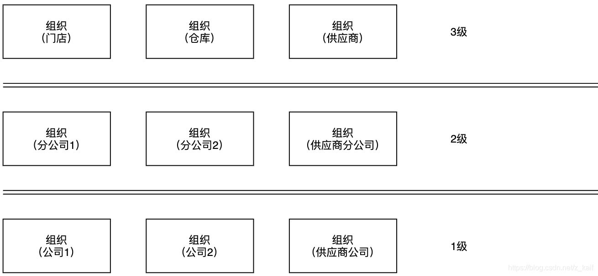
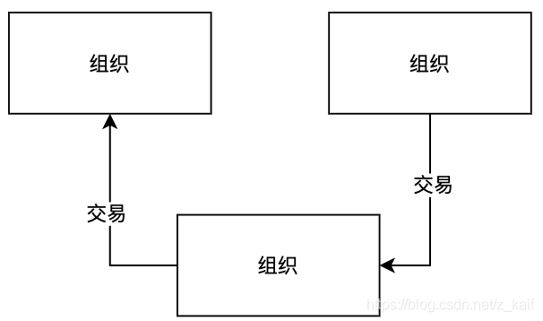
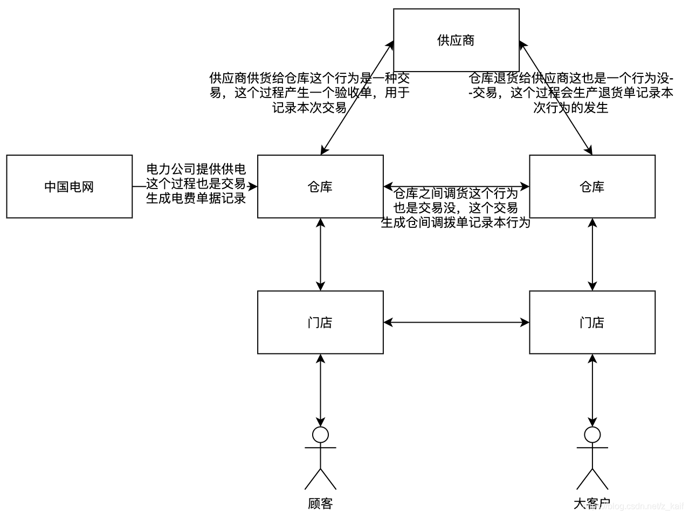
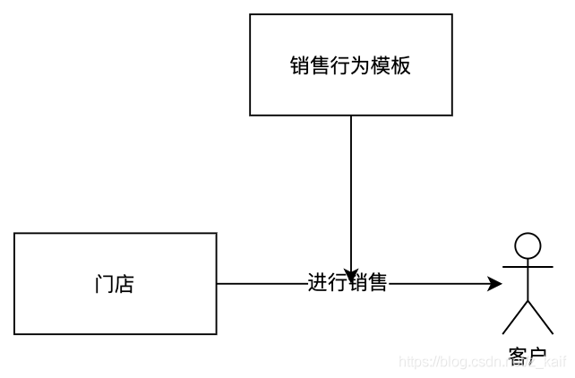

之前参与公司财务业务的开发，自己阅读《会计学基础》后，自己尝试设计了一下业务架构，现在整理记录一下。

## 基本模型

### 组织

在财务中，会计并不关心这个组织是做什么的，在财务系统开发中我们将门店 仓库 供应商等统称为组织这种级别的组织我们称之为3级组织
对于国家税务局来说，他并不关系每个一级组织的情况，他们所关系的是分公司公司及2级组织和1级组织
为了统一模型我们给每个公司建立一个虚拟子公司称之为本部子公司
以上说的公司就是子公司，总公司其实只是子公司的股东，在这套模型中作为对外投资关联
对于其他不完整的组织我们通过虚拟的方式使其变得完整

### 交易

这里先忘记之前的交易的理解
我们这里的交易是指：两个组织之间发生的某种行为，这种行为涉及到双方资产与负债的变动，交易发生在3级组织之间，
我们之所以将交易的发生放在3级组织是应为现实生活中可是是去门店购买，大客户可由仓库发货，并不是分公司，但是3级组织作为2级组织的一部分在最总汇总时可以被归属到某个2级组织甚至1级组织
门店仓库这些不同类型是组织的一个tag，组织可以同时拥有多个tag

### 单据

在交易的过程中会出现一些文件信息用于记录交易这样行为的发生过程，这种文件信息我们称之为单据
像仓库间调拨，销售，验收，这些我们都称之为单据，发票作为一种特殊的单据也是单据的一种

### 交易模型

交易的行为是可以被枚举的我们提前确定这个交易的过程，定义为交易模型
交易模型确认交易过程是如何发生的，产生什么单据，交易过程可以用于几级组织
整个交易的过程按照交易模板预先设置好的去执行

交易模板确定什么组织和什么组织之间可以发生什么交易通过组织tag确定

## 业务视图（举例说明）

### 定义

业务视图是在基本模型之上对于各种数据的处理过后生成的某种数据视图–报表
视图单据可以以来其他视图单据
处理过程包括人工审核等
直接视图是指不经过任何处理就生成的业务视图，如业务要看门店A的销售情况，可以直接查看基础模型的销售单，这个销售单在业务视图的展示需要通过直接视图进行展示
举例：如结算单，对账单，凭证

### 结算单

结算单的业务用途，结算某个子公司和供应商之间的会计期间的账务
描述过程为：通过某个子公司和某个供应商的预付款、发票、费用单、对账单进行结算，最终生成预付款单据视图
财务调整是结算单的一个处理过程
预付款和发票是基本模型中的数据
最后一个对账单是另一个业务视图，我们现在看来看一下

### 对账单

对账单是用于某个子公司和供应商之间的结算过程，最终生成结算单
对账单利用验收单，退货单，补救单这3个基础数据生成子公司和供应商之间的对账单
最终对账单提供给结算单支撑