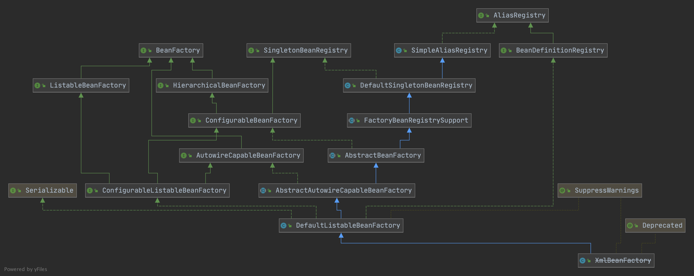

### 从接口开始



先来看看4个接口BeanFactory、SingletonBeanRegistry、AliasRegistry、BeanDefinitionRegistry

AliasRegistry定义了别名的接口而BeanDefinitionRegistry继承了AliasRegistry意味着BeanDefinitionRegistry也拥有别名的能力，另外他还扩展了注册BeanDefinition的能力。而SingletonBeanRegistry是一个单例的注册器被注册的是类的实例而不是定义。SingletonBeanRegistry、AliasRegistry、BeanDefinitionRegistry三个接口定义了3种注册器的能力。在本文中我们把这些接口统称为注册器。

再来看看BeanFactory他实际上主要定义了了对Bean的获取的能力根据名称获取或者是根据类型匹配获取。它的子接口定义了很多对工厂内部Bean查看管理的能力。这里要注意ConfigurableBeanFactory因为它继承了SingletonBeanRegistry，在这个接口之前实际上BeanFactory没有定义任何向工厂注册Bean的能力。

我们梳理一下Factory定义了对获取Bean及其配置信息的能力，而Registry定义了注册Bean的能力。

### 工厂初始化

XmlBeanFactory实际上已经被废弃但是我们可以从它入手学习会更简单，我们先来看一下XmlBeanFactory的源码。其实非常简单重点在与DefaultListableBeanFactory和XmlBeanDefinitionReader上面，本文主要讲解IOC的实现原理对于怎么解析Bean的XML文件不会过多讲解，毕竟这个时代没有人会直接使用spring-beans包，和传统的XML文件定义类。

```java
//DefaultListableBeanFactory实现了之前提到的接口，它提供了一个完整的IOC实现
public class XmlBeanFactory extends DefaultListableBeanFactory {
   //XmlBeanDefinitionReader实现了XML的解析并且注册到Factory
   private final XmlBeanDefinitionReader reader = new XmlBeanDefinitionReader(this);
   public XmlBeanFactory(Resource resource) throws BeansException {
      this(resource, null);
   }
   public XmlBeanFactory(Resource resource, BeanFactory parentBeanFactory) throws BeansException {
      super(parentBeanFactory);
      //加载xml文件，解析并且注册到工厂
      this.reader.loadBeanDefinitions(resource);
   }
}
```

我们从this.reader.loadBeanDefinitions(resource);这行代码往下跟踪找到了第一个需要关注的地方

```java
private void parseDefaultElement(Element ele, BeanDefinitionParserDelegate delegate) {
   //处理IMPORT
   if (delegate.nodeNameEquals(ele, IMPORT_ELEMENT)) {
      importBeanDefinitionResource(ele);
   }
   //处理别名
   else if (delegate.nodeNameEquals(ele, ALIAS_ELEMENT)) {
      processAliasRegistration(ele);
   }
   //处理bean
   else if (delegate.nodeNameEquals(ele, BEAN_ELEMENT)) {
      processBeanDefinition(ele, delegate);
   }
   //处理beans 递归调用之前的
   else if (delegate.nodeNameEquals(ele, NESTED_BEANS_ELEMENT)) {
      // recurse
      doRegisterBeanDefinitions(ele);
   }
}
```

importBeanDefinitionResource和doRegisterBeanDefinitions还是XML解析的实现与IOC本身无关我们忽略它。首先我们来看看别名的注册

```java
protected void processAliasRegistration(Element ele) {
   //获取元素
   String name = ele.getAttribute(NAME_ATTRIBUTE);
   String alias = ele.getAttribute(ALIAS_ATTRIBUTE);
   boolean valid = true;
   //校验
   if (!StringUtils.hasText(name)) {
      getReaderContext().error("Name must not be empty", ele);
      valid = false;
   }
   if (!StringUtils.hasText(alias)) {
      getReaderContext().error("Alias must not be empty", ele);
      valid = false;
   }
   //有效导入无效忽略
   if (valid) {
      try {
         //注册别名 重点在这里 getReaderContext().getRegistry()获取的就是XmlBeanFactory本身
         getReaderContext().getRegistry().registerAlias(name, alias);
      }
      catch (Exception ex) {
         getReaderContext().error("Failed to register alias '" + alias +
               "' for bean with name '" + name + "'", ele, ex);
      }
      //别名事件触发
      getReaderContext().fireAliasRegistered(name, alias, extractSource(ele));
   }
}
```

registerAlias方法实现了别名的注册回想一下之前说过的AliasRegistry接口这个方法就是在这里定义的。具体的功能都是在SimpleAliasRegistry类中实现的。XmlBeanFactory继承了这个类。本质就是一个aliasMap的ConcurrentHashMap实现的大家可以自己去看一下源码这里就不展开说了。

再来看一下processBeanDefinition

```java
//registry就是XmlBeanFactory本身
protected void processBeanDefinition(Element ele, BeanDefinitionParserDelegate delegate) {
   //解析bean定义
   BeanDefinitionHolder bdHolder = delegate.parseBeanDefinitionElement(ele);
   if (bdHolder != null) {
      //自定义装饰器扩展
      bdHolder = delegate.decorateBeanDefinitionIfRequired(ele, bdHolder);
      try {
         //注册到工厂 同时也会组册别名
         BeanDefinitionReaderUtils.registerBeanDefinition(bdHolder, getReaderContext().getRegistry());
      }
      catch (BeanDefinitionStoreException ex) {
         getReaderContext().error("Failed to register bean definition with name '" +
               bdHolder.getBeanName() + "'", ele, ex);
      }
      // 发送注册事件
      getReaderContext().fireComponentRegistered(new BeanComponentDefinition(bdHolder));
   }
}
```

```java
class BeanDefinitionReaderUtils{
  public static void registerBeanDefinition(
        BeanDefinitionHolder definitionHolder, BeanDefinitionRegistry registry)
        throws BeanDefinitionStoreException {
     // 组册类定义
     String beanName = definitionHolder.getBeanName();
     registry.registerBeanDefinition(beanName, definitionHolder.getBeanDefinition());
     // 注册别名
     String[] aliases = definitionHolder.getAliases();
     if (aliases != null) {
        for (String alias : aliases) {
           registry.registerAlias(beanName, alias);
        }
     }
  }
}
```

我们可以看到这里的registerBeanDefinition方法就是在BeanDefinitionRegistry接口中定义的，BeanDefinitionRegistry还继承了AliasRegistry所以它当然可以注册别名。registerBeanDefinition的实现在DefaultListableBeanFactory类中，主要就是对一个名为beanDefinitionMap的对象操作，大家可以自行去阅读源码这里就不贴代码了。

注：fireAliasRegistered和fireComponentRegistered不会再本文中提及后续会单独写一篇文章去介绍它，本文为了让读者更专注IOC的核心功能实现。

到目前为止，我们可以知道XmlBeanDefinitionReader的本质就是调用注册器把解析到的信息注册到容器中。

### 获取一个Bean

当我们执行一行获取Bean的代码时

```java
Map<String, BeanA> beansOfType = xmlBeanFactory.getBeansOfType(BeanA.class);
BeanA beanA = (BeanA)xmlBeanFactory.getBean("beanA");
```

最终都掉用了AbstractBeanFactory类的doGetBean方法，这个方法的实现比较复杂，大家需要有点耐心看下去。为了阅读方便这里删除了log的代码

```java
protected <T> T doGetBean(
      String name, @Nullable Class<T> requiredType, @Nullable Object[] args, boolean typeCheckOnly)
      throws BeansException {
   //可能是别名翻译一下 名字包含&前缀去除掉
   String beanName = transformedBeanName(name);
   Object bean;
   //可能有直接注册实例对象的或者已经被创建的单例
   //这里要提及几个核心的Map
   //singletonObjects  Map中的Bean已经完全初始化好了，可以直接使用
   //earlySingletonObjects  Map中的Bean处在创建中
   //singletonFactories   Map中存放Bean对应的工厂
   //这里会先从singletonObjects中获取 如果没有根据singletonsCurrentlyInCreation判断是否在创建中，不是直接返回null
   //如果是创建中从earlySingletonObjects中获取
   //如果也没有获取到获取singletonObjects的对象锁然后从singletonFactories中获取工厂并且创建
   Object sharedInstance = getSingleton(beanName);
   if (sharedInstance != null && args == null) {
      bean = getObjectForBeanInstance(sharedInstance, name, beanName, null);
   }
   else {
      //检查是不是有循环依赖
      if (isPrototypeCurrentlyInCreation(beanName)) {
         throw new BeanCurrentlyInCreationException(beanName);
      }
      // 检查一下 如果工厂没有定义这个bean就看一下父工厂
      BeanFactory parentBeanFactory = getParentBeanFactory();
      if (parentBeanFactory != null && !containsBeanDefinition(beanName)) {
         // Not found -> check parent.
         String nameToLookup = originalBeanName(name);
         if (parentBeanFactory instanceof AbstractBeanFactory) {
            return ((AbstractBeanFactory) parentBeanFactory).doGetBean(
                  nameToLookup, requiredType, args, typeCheckOnly);
         }
         else if (args != null) {
            // Delegation to parent with explicit args.
            return (T) parentBeanFactory.getBean(nameToLookup, args);
         }
         else if (requiredType != null) {
            // No args -> delegate to standard getBean method.
            return parentBeanFactory.getBean(nameToLookup, requiredType);
         }
         else {
            return (T) parentBeanFactory.getBean(nameToLookup);
         }
      }
      //校验
      if (!typeCheckOnly) {
         /* 如果创建bean不是为了类型检查，则要标记当前bean已经被创建或者即将被创建以便于BeanFactory可以优化重复创建的bean的缓存 */
         markBeanAsCreated(beanName);
      }
      StartupStep beanCreation = this.applicationStartup.start("spring.beans.instantiate")
            .tag("beanName", name);
      try {
         if (requiredType != null) {
            beanCreation.tag("beanType", requiredType::toString);
         }
         //大家应该记得之前注册的BeanDefinition吧，getMergedLocalBeanDefinition内部获取BeanDefinition后
         //会去查看是否有Parent BeanDefinition有的话继承它的属性 没有的话把自己包装成一个RootBeanDefinition
         RootBeanDefinition mbd = getMergedLocalBeanDefinition(beanName);
         checkMergedBeanDefinition(mbd, beanName, args);

         // Guarantee initialization of beans that the current bean depends on.
         // 处理依赖 如果有配置DependsOn这里会先初始化依赖类
         String[] dependsOn = mbd.getDependsOn();
         if (dependsOn != null) {
            for (String dep : dependsOn) {
               //利用dependentBeanMap可以判断出是否循环依赖
               if (isDependent(beanName, dep)) {
                  throw new BeanCreationException(mbd.getResourceDescription(), beanName,
                        "Circular depends-on relationship between '" + beanName + "' and '" + dep + "'");
               }
               registerDependentBean(dep, beanName);
               try {
                  //递归调用 先创建依赖类
                  getBean(dep);
               }
               catch (NoSuchBeanDefinitionException ex) {
                  throw new BeanCreationException(mbd.getResourceDescription(), beanName,
                        "'" + beanName + "' depends on missing bean '" + dep + "'", ex);
               }
            }
         }
         // 如果是单例Bean
         if (mbd.isSingleton()) {
            //看下面单独介绍 创建一个单例对象并且返回
            sharedInstance = getSingleton(beanName, () -> {
               try {
                  //利用注册的信息创建Bean
                  //createBean中实现了lookup-method和replace-method
                  //和BeanPostProcessor
                  //以及创建实例
                  //填充属性 AutoWrite也是这里实现的
                  return createBean(beanName, mbd, args);
               }
               catch (BeansException ex) {
                  // Explicitly remove instance from singleton cache: It might have been put there
                  // eagerly by the creation process, to allow for circular reference resolution.
                  // Also remove any beans that received a temporary reference to the bean.
                  destroySingleton(beanName);
                  throw ex;
               }
            });
            //同上
            bean = getObjectForBeanInstance(sharedInstance, name, beanName, mbd);
         }
         else if (mbd.isPrototype()) {
            // It's a prototype -> create a new instance.
            Object prototypeInstance = null;
            try {
               beforePrototypeCreation(beanName);
               prototypeInstance = createBean(beanName, mbd, args);
            }
            finally {
               afterPrototypeCreation(beanName);
            }
            bean = getObjectForBeanInstance(prototypeInstance, name, beanName, mbd);
         }
         //自定义scope扩展
         else {
            String scopeName = mbd.getScope();
            if (!StringUtils.hasLength(scopeName)) {
               throw new IllegalStateException("No scope name defined for bean ´" + beanName + "'");
            }
            Scope scope = this.scopes.get(scopeName);
            if (scope == null) {
               throw new IllegalStateException("No Scope registered for scope name '" + scopeName + "'");
            }
            try {
               Object scopedInstance = scope.get(beanName, () -> {
                  beforePrototypeCreation(beanName);
                  try {
                     return createBean(beanName, mbd, args);
                  }
                  finally {
                     afterPrototypeCreation(beanName);
                  }
               });
               bean = getObjectForBeanInstance(scopedInstance, name, beanName, mbd);
            }
            catch (IllegalStateException ex) {
               throw new ScopeNotActiveException(beanName, scopeName, ex);
            }
         }
      }
      catch (BeansException ex) {
         beanCreation.tag("exception", ex.getClass().toString());
         beanCreation.tag("message", String.valueOf(ex.getMessage()));
         cleanupAfterBeanCreationFailure(beanName);
         throw ex;
      }
      finally {
         beanCreation.end();
      }
   }
   // Check if required type matches the type of the actual bean instance.
   // 检查类型是否符合
   if (requiredType != null && !requiredType.isInstance(bean)) {
      try {
         T convertedBean = getTypeConverter().convertIfNecessary(bean, requiredType);
         if (convertedBean == null) {
            throw new BeanNotOfRequiredTypeException(name, requiredType, bean.getClass());
         }
         return convertedBean;
      }
      catch (TypeMismatchException ex) {
         if (logger.isTraceEnabled()) {
            logger.trace("Failed to convert bean '" + name + "' to required type '" +
                  ClassUtils.getQualifiedName(requiredType) + "'", ex);
         }
         throw new BeanNotOfRequiredTypeException(name, requiredType, bean.getClass());
      }
   }
   return (T) bean;
}
```

### 总结

SpringIOC大体上抽象成了两个部分一个注册器，一个是工厂，工厂通过注册器提供的信息创建Bean。

IOC的实现其实十分复杂，这里只是做了简单的概念性介绍，后续会单独去讲解BeanPostProcessor接口提供的扩展能力、各种事件通知、Aware接口、Bean初始化流程等等。