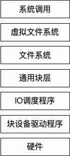
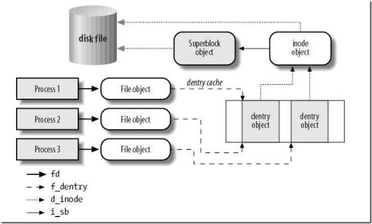

```java
public class File implements Serializable, Comparable<File>
```

File类实现了Serializable, Comparable接口，可序列化，可以比较

Comparable接口的实现调用了FileSystem，FileSystem通过对比File的path字符串来返回，所以最终还是使用了String类型的Comparable实现。

```java
private static final FileSystem fs = DefaultFileSystem.getFileSystem();
public int compareTo(File pathname) {
    return fs.compare(this, pathname);
}

//fs  FileSystem
public int compare(File f1, File f2) {
    return f1.getPath().compareTo(f2.getPath());
}
```

FileSystem是个抽象类封装了一些本地文件系统的操作和描述所以每个系统都会获取到不一样的实例MacOS和Linux是UnixFileSystem对象因为他们都是类Unix系统，windows是WinNTFileSystem

后面使用到的时候在来详细说明FileSystem的实现，大家把它理解成一个工具类就好了，它隐藏不同操作系统的细节，让File类不需要去关注操作系统本身。

```java
/**
 * The FileSystem object representing the platform's local file system.
 * 这个是static所以是一个单例
 */
private static final FileSystem fs = DefaultFileSystem.getFileSystem();
```

### 构造方法


```java
private File(String child, File parent)
private File(String pathname, int prefixLength)
public File(String pathname)
public File(String parent, String child)
public File(File parent, String child)
public File(URI uri)
```

```java
public File(String pathname) {
    if (pathname == null) {
        throw new NullPointerException();
    }
  //normalize就是一个字符串的处理过程把/aaa//bbb///ccc/ 都变成/aaa/bbb/ccc
    this.path = fs.normalize(pathname);
  //prefixLength查看path的第一个字符是不是‘/’是的话返回1，不然返回0
    this.prefixLength = fs.prefixLength(this.path);
}
public File(String parent, String child) {
    if (child == null) {
        throw new NullPointerException();
    }
    if (parent != null) {
        if (parent.equals("")) {
          //大家可以理解成parent和child拼接，不过他会处理多余和缺少/的情况，还有空字符串
          //getDefaultParent返回常量“/”
          //用户传入的路径都要经过normalize处理后才能使用
            this.path = fs.resolve(fs.getDefaultParent(),
                                    fs.normalize(child));
        } else {
          //和上面一样
            this.path = fs.resolve(fs.normalize(parent),
                                    fs.normalize(child));
        }
      //这里可以看出如果parent是null或者“”的时候和File(String pathname)逻辑一样
    } else {//如果parent是null和File(String pathname)逻辑一样
        this.path = fs.normalize(child);
    }
    this.prefixLength = fs.prefixLength(this.path);
}
//这个就不说了其实就是把String的parent换成File.path
public File(File parent, String child)

public File(URI uri) {
    // Check our many preconditions
  // 一堆校验大家自己看看就好
    if (!uri.isAbsolute())
        throw new IllegalArgumentException("URI is not absolute");
    if (uri.isOpaque())
        throw new IllegalArgumentException("URI is not hierarchical");
    String scheme = uri.getScheme();
    if ((scheme == null) || !scheme.equalsIgnoreCase("file"))
        throw new IllegalArgumentException("URI scheme is not \"file\"");
    if (uri.getRawAuthority() != null)
        throw new IllegalArgumentException("URI has an authority component");
    if (uri.getRawFragment() != null)
        throw new IllegalArgumentException("URI has a fragment component");
    if (uri.getRawQuery() != null)
        throw new IllegalArgumentException("URI has a query component");
    String p = uri.getPath();
    if (p.equals(""))
        throw new IllegalArgumentException("URI path component is empty");

    // Okay, now initialize
    // fromURIPath复制一下源码的注释很好懂  "/foo/" --> "/foo", but "/" --> "/"
    p = fs.fromURIPath(p);
  // separatorChar下面马上说
    if (File.separatorChar != '/')
        p = p.replace('/', File.separatorChar);
  //这两行之前说过
    this.path = fs.normalize(p);
    this.prefixLength = fs.prefixLength(this.path);
}
//对于内部可信任的调用避免使用normalize
private File(String pathname, int prefixLength) {
    this.path = pathname;
    this.prefixLength = prefixLength;
}
//对于内部可信任的调用避免使用normalize
private File(String child, File parent) {
  //不知道assert的同学赶紧赶紧去查查把，主要是调试用的
    assert parent.path != null;
    assert (!parent.path.equals(""));
    this.path = fs.resolve(parent.path, child);
    this.prefixLength = parent.prefixLength;
}

//这两个字段具体在什么地方会用后面再说
    /**
     * This abstract pathname's normalized pathname string. A normalized
     * pathname string uses the default name-separator character and does not
     * contain any duplicate or redundant separators.
     *
     * @serial
     */
    private final String path;
    /**
     * The length of this abstract pathname's prefix, or zero if it has no
     * prefix.
     */
//第二个生僻关键字transient这个是与Serializable接口相关的
    private final transient int prefixLength;
```

separatorChar

```java
/**
 * The system-dependent default name-separator character.  This field is
 * initialized to contain the first character of the value of the system
 * property <code>file.separator</code>.  On UNIX systems the value of this
 * field is <code>'/'</code>; on Microsoft Windows systems it is <code>'\\'</code>.
 *
 * @see     java.lang.System#getProperty(java.lang.String)
 */
//getSeparator返回一个slash变量这变量是UnixFileSystem的构造方法里面设置的
//刚刚说过UnixFileSystem是一个单例，所以在第一次调用File的时候就会设置slash变量
//Properties props = GetPropertyAction.privilegedGetProperties();最终是System.getProperties()
//slash = props.getProperty("file.separator").charAt(0);Unix都是‘/’
public static final char separatorChar = fs.getSeparator();

/**
 * The system-dependent default name-separator character, represented as a
 * string for convenience.  This string contains a single character, namely
 * {@link #separatorChar}.
 */
//char转化String
public static final String separator = "" + separatorChar;
```

### 方法实现

我把File中的方法分为几类

+ 大多逻辑在方法中处理字符串
+ 大多逻辑调用FileSystem处理字符串（因为不同操作系统的路径规则不一样，有些处理依赖具体操作系统）
+ 调用FileSystem Native方法进行处理的
+ 其他

#### File处理字符串类的方法

简单举例getName  getParent两个方法，这种方法实现非常简单

```java
// aa -> aa        /ds/aa -> aa      / -> ""
public String getName() {
    int index = path.lastIndexOf(separatorChar);
    if (index < prefixLength) return path.substring(prefixLength);
    return path.substring(index + 1);
}

public String getParent() {
    int index = path.lastIndexOf(separatorChar);
    if (index < prefixLength) {
        if ((prefixLength > 0) && (path.length() > prefixLength))
            return path.substring(0, prefixLength);
        return null;
    }
    return path.substring(0, index);
}
```

#### 调用FileSystem处理字符串

还有一些方法是调用FileSystem解析字符串，主要是因为每个操作系统的文件路径规则不一样

```java
public boolean isAbsolute() {
    return fs.isAbsolute(this);
}
//UnixFileSystem类中 PrefixLength>0 说明是/开头就是绝对路径
public boolean isAbsolute(File f) {
    return (f.getPrefixLength() != 0);
}
```

类似的还有


```java
//先处理字符串然后调用之前说过的私有构造方法
public File getParentFile() {
    String p = this.getParent();
    if (p == null) return null;
  //这里就是使用了私有构造方法
    return new File(p, this.prefixLength);
}
```
#### 调用Native方法

```java
public boolean setReadOnly() {
    SecurityManager security = System.getSecurityManager();
    if (security != null) {
        security.checkWrite(path);
    }
    if (isInvalid()) {
        return false;
    }
    return fs.setReadOnly(this);
}
public boolean delete() {
    SecurityManager security = System.getSecurityManager();
    if (security != null) {
        security.checkDelete(path);
    }
    if (isInvalid()) {
        return false;
    }
    return fs.delete(this);
}
```

这里我把调用Native方法整理了一下

不过表格中对应系统函数不一定准确，因为JDK源码中有条件编译去替换一些类名

| File方法                                    | 对应的Native方法      | 对应系统函数                                                 |
| ------------------------------------------- | --------------------- | ------------------------------------------------------------ |
| canRead、canWrite、canExecute               | checkAccess           | access                                                       |
| exists、isDirectory、isFile、isHidden       | getBooleanAttributes0 | stat64                                                       |
| lastModified                                | getLastModifiedTime   | stat64                                                       |
| length                                      | getLength             | stat64                                                       |
| createNewFile                               | createFileExclusively | handleOpen(path, O_RDWR \| O_CREAT \| O_EXCL, 0666)<br />open64(path, oflag, mode)<br />#define open64 open |
| delete                                      | delete                | remove                                                       |
| list                                        | list                  | opendir、readdir_r                                           |
| mkdir                                       | createDirectory       | mkdir(path, 0777)                                            |
| renameTo                                    | rename0               | rename                                                       |
| setLastModified                             | setLastModified       | stat64                                                       |
| setReadOnly                                 | setReadOnly           | stat64                                                       |
| setWritable、setReadable、setExecutable     | setPermission         | stat64                                                       |
| getTotalSpace、getFreeSpace、getUsableSpace | getSpace              | statvfs64                                                    |

#### 小结

所以File其实本身就是一个工具类，封装了对路径的处理和文件相关的系统调用，在面向对象的思维中一个File对象应该对应一个唯一的文件或是目录，path变量指定了具体什么文件。

并且为了File类不耦合与具体操作系统，File类的设计者又将File类中和系统相关的操作抽象成了FileSystem供File类使用。

### 扩展知识点：Linux中的文件



在Linux系统中如果我们进行一次系统调用如stat64函数，它会先访问Linux的虚拟文件系统，虚拟文件系统会去调用该文件所对应的文件系统，最终调用驱动程序从硬盘上返回特定信息。



（图片来自《深入理解Linux内核》书中）

在虚拟文件系统中会有以下几个对象：

+ 超级块 设备挂载时创建
+ 索引节点 对应一个唯一文件
+ 目录项 对应一个唯一路径 不同文件系统实现不一样 ext文件系统中不会存储该对象，在文件系统的索引节点中保存路径
+ 文件对象 文件打开时创建，一个进程打开一个文件都会创建一个文件对象

通常情况下对于stat64方法可以通过文件路径确定一个目录项，然后通过目录项找到索引节点，索引节点可以确定唯一的文件，也可以知道文件对应的超级块，这样就能向对应的文件系统发起请求。文件系统维护了数据存储到设备的方式，最终调用驱动程序从特定的物理地址上取得数据。

