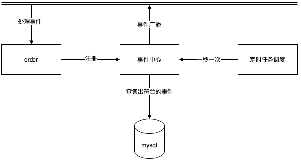
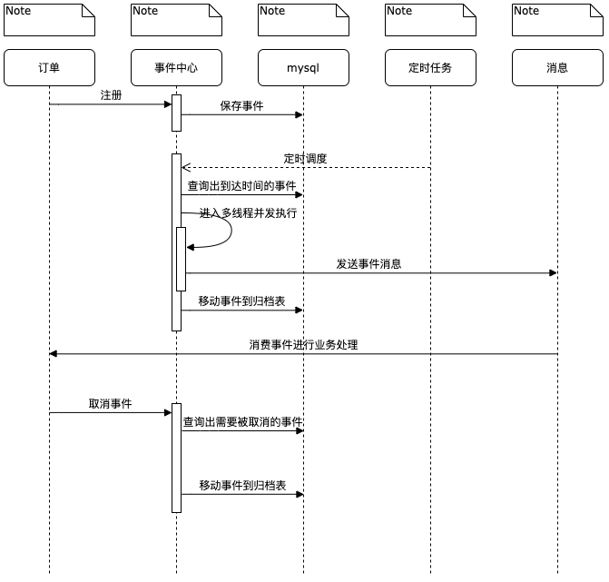

本文只是提供一个简单的思考方向，实现方案只是举例说明，如果读者也需要一个类似的功能，可以根据以下思路去完善。

### 背景

在订单系统的业务中通常会碰到类似这样的功能

+ 订单5分钟未支付自动取消订单
+ 订单支付30分钟后自动接单
+ 订单15天后自动确认收货

或者在逆交易中有类似这样的需求

+ 优惠券相关的商品金额退款完成后退还优惠券

通常实现方案

+ 延时消息，消息队列对于存储时间过长的数据可能无法支持像RocketMQ默认配置最大保存2天，大多不支持取消
+ 数据库加索引扫描出合适订单，造成业务库索引过多影响性能，需要自己维护关联关系，有时候筛选条件存在多个，需要定时任务扫描业务库

基于这类需求经过分析抽象后，梳理出了一个事件中心的概念，去解决这类问题

总体思路是业务放向事件中心注册事件后，事件中心会主动发送消息或者是其他方式去通知到业务方，从而触发业务代码的执行。

### 总体架构

事件中心以与业务不相关的方式去实现，统一向业务方提供服务，事件中心仅仅解决如何触发的问题，减轻业务库的压力

### UML

+ 租户id代表一个业务方
+ 三方ID表示是一个业务内的事件归属对象如一个订单，一个优惠券
+ 三方类型用于用户自定义（后续进一步抽象事件中心会非常有用）
+ 扩展字段，用于用户自己数据透传，触发时会带给用户

### 核心流程

时间时间用于处理多少时间后通知业务的场景，定时调度保证租户ID纬度单线程

增量事件用于处理数量到达一定值的时候触发业务，第一次注册创建事件，后续注册增加值，超时机制只是确保一个事件的失效不要让业务以来它，可以同时创建一个时间事件补充，定时调度保证租户ID纬度单线程

### 事件管理器

按照以上的描述，业务仍然需要去自己管理事件，创建事件，取消事件。

所以我们在事件之上抽象一成事件管理器。这样业务应用只需要抽象自己的业务本身，如订单的创建可以对应一个事件管理器支付可以对应一个事件管理器。然后我们配置事件管理器的内容

我们举例一个支付事件管理器，它的主要工作如下

+ 取消5分钟超时事件
+ 创建30分钟后商家自动接单事件

这样我们把每个事件的三方id和对应的操作保存在事件管理器中，并且事件管理器也可以有参数，我们可以配置这些参数传给某个事件的某个字段。

### 总结

本质上事件中心只是在技术视角上对一类功能进行抽象，从而解决如何找到需要背处理的数据的问题，然后将它们剥离出来，以降低业务应用的复杂度。在后续事件过多后，为了避免业务代码与具体事件耦合，在事件之上再抽象了一层管理器，来帮助业务应用去维护好自己的事件。