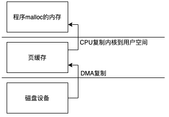
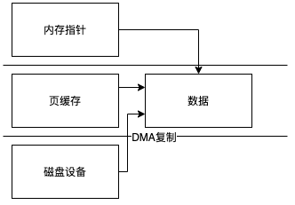
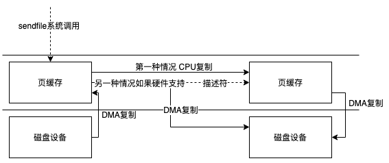
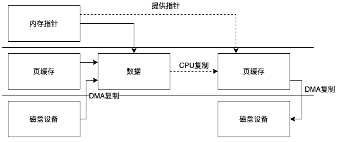
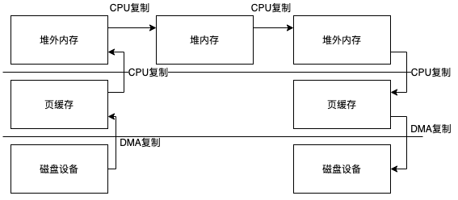
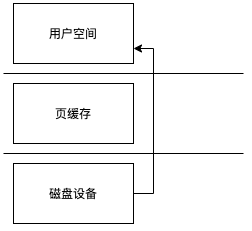

本文只考虑Linux系统

### 传统IO

+ FileOutputStream
+ FileInputStream
+ RandomAccessFile

这些类的实现最终都会通过native方法调用c代码

```java
//FileOutputStream
private native void write(int b, boolean append) throws IOException;
private native void writeBytes(byte b[], int off, int len, boolean append) throws IOException;

//FileInputStream
private native int read0() throws IOException;
private native int readBytes(byte b[], int off, int len) throws IOException;

//RandomAccessFile
private native int read0() throws IOException;
private native int readBytes(byte b[], int off, int len) throws IOException;
private native void write0(int b) throws IOException;
private native void writeBytes(byte b[], int off, int len) throws IOException;
```

看一下native的实现

```c
//FileOutputStream_md.c
JNIEXPORT void JNICALL
Java_java_io_FileOutputStream_write(JNIEnv *env, jobject this, jint byte, jboolean append) {
    writeSingle(env, this, byte, append, fos_fd);
}
JNIEXPORT void JNICALL
Java_java_io_FileOutputStream_writeBytes(JNIEnv *env,
    jobject this, jbyteArray bytes, jint off, jint len, jboolean append) {
    writeBytes(env, this, bytes, off, len, append, fos_fd);
}

//FileInputStream.c
JNIEXPORT jint JNICALL
Java_java_io_FileInputStream_read0(JNIEnv *env, jobject this) {
    return readSingle(env, this, fis_fd);
}
JNIEXPORT jint JNICALL
Java_java_io_FileInputStream_readBytes(JNIEnv *env, jobject this,
        jbyteArray bytes, jint off, jint len) {
    return readBytes(env, this, bytes, off, len, fis_fd);
}

//RandomAccessFile.c
JNIEXPORT jint JNICALL
Java_java_io_RandomAccessFile_read0(JNIEnv *env, jobject this) {
    return readSingle(env, this, raf_fd);
}
JNIEXPORT jint JNICALL
Java_java_io_RandomAccessFile_readBytes(JNIEnv *env,
    jobject this, jbyteArray bytes, jint off, jint len) {
    return readBytes(env, this, bytes, off, len, raf_fd);
}
JNIEXPORT void JNICALL
Java_java_io_RandomAccessFile_write0(JNIEnv *env, jobject this, jint byte) {
    writeSingle(env, this, byte, JNI_FALSE, raf_fd);
}
JNIEXPORT void JNICALL
Java_java_io_RandomAccessFile_writeBytes(JNIEnv *env,
    jobject this, jbyteArray bytes, jint off, jint len) {
    writeBytes(env, this, bytes, off, len, JNI_FALSE, raf_fd);
}
```

最终的实现都在io_util.c里面

```c
jint
readSingle(JNIEnv *env, jobject this, jfieldID fid) {
    jint nread;
    char ret;
    FD fd = GET_FD(this, fid);
    if (fd == -1) {
        JNU_ThrowIOException(env, "Stream Closed");
        return -1;
    }
    nread = IO_Read(fd, &ret, 1);
    if (nread == 0) { /* EOF */
        return -1;
    } else if (nread == -1) { /* error */
        JNU_ThrowIOExceptionWithLastError(env, "Read error");
    }
    return ret & 0xFF;
}

/* The maximum size of a stack-allocated buffer.
 */
#define BUF_SIZE 8192

/*
 * Returns true if the array slice defined by the given offset and length
 * is out of bounds.
 */
static int
outOfBounds(JNIEnv *env, jint off, jint len, jbyteArray array) {
    return ((off < 0) ||
            (len < 0) ||
            // We are very careful to avoid signed integer overflow,
            // the result of which is undefined in C.
            ((*env)->GetArrayLength(env, array) - off < len));
}

jint
readBytes(JNIEnv *env, jobject this, jbyteArray bytes,
          jint off, jint len, jfieldID fid)
{
    jint nread;
    char stackBuf[BUF_SIZE];
    char *buf = NULL;
    FD fd;

    if (IS_NULL(bytes)) {
        JNU_ThrowNullPointerException(env, NULL);
        return -1;
    }

    if (outOfBounds(env, off, len, bytes)) {
        JNU_ThrowByName(env, "java/lang/IndexOutOfBoundsException", NULL);
        return -1;
    }

    if (len == 0) {
        return 0;
    } else if (len > BUF_SIZE) {
        buf = malloc(len);
        if (buf == NULL) {
            JNU_ThrowOutOfMemoryError(env, NULL);
            return 0;
        }
    } else {
        buf = stackBuf;
    }

    fd = GET_FD(this, fid);
    if (fd == -1) {
        JNU_ThrowIOException(env, "Stream Closed");
        nread = -1;
    } else {
        nread = IO_Read(fd, buf, len);
        if (nread > 0) {
            (*env)->SetByteArrayRegion(env, bytes, off, nread, (jbyte *)buf);
        } else if (nread == -1) {
            JNU_ThrowIOExceptionWithLastError(env, "Read error");
        } else { /* EOF */
            nread = -1;
        }
    }

    if (buf != stackBuf) {
        free(buf);
    }
    return nread;
}

void
writeSingle(JNIEnv *env, jobject this, jint byte, jboolean append, jfieldID fid) {
    // Discard the 24 high-order bits of byte. See OutputStream#write(int)
    char c = (char) byte;
    jint n;
    FD fd = GET_FD(this, fid);
    if (fd == -1) {
        JNU_ThrowIOException(env, "Stream Closed");
        return;
    }
    if (append == JNI_TRUE) {
        n = IO_Append(fd, &c, 1);
    } else {
        n = IO_Write(fd, &c, 1);
    }
    if (n == -1) {
        JNU_ThrowIOExceptionWithLastError(env, "Write error");
    }
}

void
writeBytes(JNIEnv *env, jobject this, jbyteArray bytes,
           jint off, jint len, jboolean append, jfieldID fid)
{
    jint n;
    char stackBuf[BUF_SIZE];
    char *buf = NULL;
    FD fd;

    if (IS_NULL(bytes)) {
        JNU_ThrowNullPointerException(env, NULL);
        return;
    }

    if (outOfBounds(env, off, len, bytes)) {
        JNU_ThrowByName(env, "java/lang/IndexOutOfBoundsException", NULL);
        return;
    }

    if (len == 0) {
        return;
    } else if (len > BUF_SIZE) {
        buf = malloc(len);
        if (buf == NULL) {
            JNU_ThrowOutOfMemoryError(env, NULL);
            return;
        }
    } else {
        buf = stackBuf;
    }

    (*env)->GetByteArrayRegion(env, bytes, off, len, (jbyte *)buf);

    if (!(*env)->ExceptionOccurred(env)) {
        off = 0;
        while (len > 0) {
            fd = GET_FD(this, fid);
            if (fd == -1) {
                JNU_ThrowIOException(env, "Stream Closed");
                break;
            }
            if (append == JNI_TRUE) {
                n = IO_Append(fd, buf+off, len);
            } else {
                n = IO_Write(fd, buf+off, len);
            }
            if (n == -1) {
                JNU_ThrowIOExceptionWithLastError(env, "Write error");
                break;
            }
            off += n;
            len -= n;
        }
    }
    if (buf != stackBuf) {
        free(buf);
    }
}

JNIEXPORT void JNICALL
throwFileNotFoundException(JNIEnv *env, jstring path)
{
    char buf[256];
    size_t n;
    jobject x;
    jstring why = NULL;

    n = getLastErrorString(buf, sizeof(buf));
    if (n > 0) {
#ifdef WIN32
        why = (*env)->NewStringUTF(env, buf);
#else
        why = JNU_NewStringPlatform(env, buf);
#endif
        CHECK_NULL(why);
    }
    x = JNU_NewObjectByName(env,
                            "java/io/FileNotFoundException",
                            "(Ljava/lang/String;Ljava/lang/String;)V",
                            path, why);
    if (x != NULL) {
        (*env)->Throw(env, x);
    }
}
```

其中的IO_Write与IO_Read是宏定义具体实现依赖操作系统

```c
#define IO_Write handleWrite
#define IO_Read handleRead
```

unix目录下的io_util_md.c实现了类unix系统的实现，其本质就是调用了两个系统调用read与write

```c
ssize_t
handleRead(FD fd, void *buf, jint len)
{
    ssize_t result;
    RESTARTABLE(read(fd, buf, len), result);
    return result;
}

ssize_t
handleWrite(FD fd, const void *buf, jint len)
{
    ssize_t result;
    RESTARTABLE(write(fd, buf, len), result);
    return result;
}

RESTARTABLE是一个宏定义在io_util_md.h中
#define RESTARTABLE(_cmd, _result) do { \
    do { \
        _result = _cmd; \
    } while((_result == -1) && (errno == EINTR)); \
} while(0)

void fileDescriptorClose(JNIEnv *env, jobject this);

#ifdef MACOSX
jstring newStringPlatform(JNIEnv *env, const char* str);
#endif
```

read与write函数

```c
read(int, void *, size_t)
write(int __fd, const void * __buf, size_t __nbyte)
```

我们可以看到第二个参数是一个指针指向用户空间的要被写入或者读取的地址。

这两个系统调用会有一次用户态到内核态切换当然执行完成后还要切换回来，read会从内核空间中读取数据复制到用户空间的指定地址，这里会有一次复制，如果命中页缓存者直接读取，否则产生缺页，DMA会把设备中的数据复制到内核空间，这里也会有一次复制。JVM读取到从read方法返回的数据后会在用户态再进行一次复制，从堆外内存到JVM堆内存中。

所以整个流程是这样的(直接IO我们最后单独讨论)


write也类似这里不过多介绍

### NIO

NIO提供了FileChannel来操作文件

FileChannel提供了更优秀的封装方式，并且使用了一些性能更好的系统调用。

我们从几个方面入手分析FileChannel

+ 使用HeapByteBuffer的read与write
+ 使用DirectBuffer实现类的read与write
+ map方法实现
+ transferTo与transferFrom实现

read与write基本类似这里我们就只分析一下read的具体实现

```java
public int read(ByteBuffer dst) throws IOException {
    ensureOpen();
    if (!readable)
        throw new NonReadableChannelException();
    synchronized (positionLock) {
        if (direct)
            Util.checkChannelPositionAligned(position(), alignment);
        int n = 0;
        int ti = -1;
        try {
            beginBlocking();
            ti = threads.add();
            if (!isOpen())
                return 0;
            do {
              //这里调用工具类进行读取 代码看下面
                n = IOUtil.read(fd, dst, -1, direct, alignment, nd);
            } while ((n == IOStatus.INTERRUPTED) && isOpen());
            return IOStatus.normalize(n);
        } finally {
            threads.remove(ti);
            endBlocking(n > 0);
            assert IOStatus.check(n);
        }
    }
}

//IOUtil中的方法
static int read(FileDescriptor fd, ByteBuffer dst, long position,
                boolean directIO, int alignment, NativeDispatcher nd)
    throws IOException
{
    if (dst.isReadOnly())
        throw new IllegalArgumentException("Read-only buffer");
  //如果是DirectBuffer实现类直接开始读取
    if (dst instanceof DirectBuffer)
        return readIntoNativeBuffer(fd, dst, position, directIO, alignment, nd);

    // Substitute a native buffer
  //创建一个临时的DirectBuffer实现类
    ByteBuffer bb;
    int rem = dst.remaining();
    if (directIO) {
        Util.checkRemainingBufferSizeAligned(rem, alignment);
        bb = Util.getTemporaryAlignedDirectBuffer(rem, alignment);
    } else {
        bb = Util.getTemporaryDirectBuffer(rem);
    }
    try {
      //读取到临时的实现类中
        int n = readIntoNativeBuffer(fd, bb, position, directIO, alignment,nd);
        bb.flip();
        if (n > 0)
          //复制到非DirectBuffer接口实现的ByteBuffer对象中
            dst.put(bb);
        return n;
    } finally {
        Util.offerFirstTemporaryDirectBuffer(bb);
    }
}

private static int readIntoNativeBuffer(FileDescriptor fd, ByteBuffer bb,
                                        long position, boolean directIO,
                                        int alignment, NativeDispatcher nd)
    throws IOException
{
    int pos = bb.position();
    int lim = bb.limit();
    assert (pos <= lim);
    int rem = (pos <= lim ? lim - pos : 0);

    if (directIO) {
        Util.checkBufferPositionAligned(bb, pos, alignment);
        Util.checkRemainingBufferSizeAligned(rem, alignment);
    }

    if (rem == 0)
        return 0;
    int n = 0;
    if (position != -1) {
      //nd是FileDispatcherImpl对象
      //指定position读取数据
      //((DirectBuffer)bb).address()注意这个 把DirectBuffer实现类对应的用户空间的内存地址传递给native方法
        n = nd.pread(fd, ((DirectBuffer)bb).address() + pos, rem, position);
    } else {
      //顺序读取数据
        n = nd.read(fd, ((DirectBuffer)bb).address() + pos, rem);
    }
    if (n > 0)
        bb.position(pos + n);
    return n;
}

//FileDispatcherImpl中的方法
int read(FileDescriptor fd, long address, int len) throws IOException {
  //native方法
    return read0(fd, address, len);
}

int pread(FileDescriptor fd, long address, int len, long position)
    throws IOException
{
  //native方法
    return pread0(fd, address, len, position);
}
```

```c
JNIEXPORT jint JNICALL
Java_sun_nio_ch_FileDispatcherImpl_read0(JNIEnv *env, jclass clazz,
                             jobject fdo, jlong address, jint len)
{
    jint fd = fdval(env, fdo);
  //指针指向 DirectBuffer实现类对应的内存地址，所以没有堆外复制到堆内的操作
    void *buf = (void *)jlong_to_ptr(address);
  //最终调用read方法 
    return convertReturnVal(env, read(fd, buf, len), JNI_TRUE);
}

JNIEXPORT jint JNICALL
Java_sun_nio_ch_FileDispatcherImpl_pread0(JNIEnv *env, jclass clazz, jobject fdo,
                            jlong address, jint len, jlong offset)
{
    jint fd = fdval(env, fdo);
  //类似上面
    void *buf = (void *)jlong_to_ptr(address);
  //最终调用pread64方法
    return convertReturnVal(env, pread64(fd, buf, len, offset), JNI_TRUE);
}
```

所以如果使用HeapByteBuffer整个过程和传统IO 差不多


但是如果使用DirectBuffer实现类整个过程就少了一次复制，但是前提是这部分数据不会再堆内存中使用否则当你调用ByteBuffer的read的时候仍然会通过UnSafe类中的方法把数据复制到堆内存中




#### map方法实现

这个方法很长我门就看看我们关系的几行关键的代码

```java
public MappedByteBuffer map(MapMode mode, long position, long size)
    throws IOException
{
    ensureOpen();
    if (mode == null)
        throw new NullPointerException("Mode is null");
    if (position < 0L)
        throw new IllegalArgumentException("Negative position");
    if (size < 0L)
        throw new IllegalArgumentException("Negative size");
    if (position + size < 0)
        throw new IllegalArgumentException("Position + size overflow");
    if (size > Integer.MAX_VALUE)
        throw new IllegalArgumentException("Size exceeds Integer.MAX_VALUE");

    int imode = -1;
    if (mode == MapMode.READ_ONLY)
        imode = MAP_RO;
    else if (mode == MapMode.READ_WRITE)
        imode = MAP_RW;
    else if (mode == MapMode.PRIVATE)
        imode = MAP_PV;
    assert (imode >= 0);
    if ((mode != MapMode.READ_ONLY) && !writable)
        throw new NonWritableChannelException();
    if (!readable)
        throw new NonReadableChannelException();

    long addr = -1;
    int ti = -1;
    try {
        beginBlocking();
        ti = threads.add();
        if (!isOpen())
            return null;

        long mapSize;
        int pagePosition;
        synchronized (positionLock) {
            long filesize;
            do {
                filesize = nd.size(fd);
            } while ((filesize == IOStatus.INTERRUPTED) && isOpen());
            if (!isOpen())
                return null;

            if (filesize < position + size) { // Extend file size
                if (!writable) {
                    throw new IOException("Channel not open for writing " +
                        "- cannot extend file to required size");
                }
                int rv;
                do {
                    rv = nd.truncate(fd, position + size);
                } while ((rv == IOStatus.INTERRUPTED) && isOpen());
                if (!isOpen())
                    return null;
            }

            if (size == 0) {
                addr = 0;
                // a valid file descriptor is not required
                FileDescriptor dummy = new FileDescriptor();
                if ((!writable) || (imode == MAP_RO))
                    return Util.newMappedByteBufferR(0, 0, dummy, null);
                else
                    return Util.newMappedByteBuffer(0, 0, dummy, null);
            }

            pagePosition = (int)(position % allocationGranularity);
            long mapPosition = position - pagePosition;
            mapSize = size + pagePosition;
            try {
                // If map0 did not throw an exception, the address is valid
              //=====这里返回一个内存地址map0是一个native方法=====
                addr = map0(imode, mapPosition, mapSize);
            } catch (OutOfMemoryError x) {
                // An OutOfMemoryError may indicate that we've exhausted
                // memory so force gc and re-attempt map
                System.gc();
                try {
                    Thread.sleep(100);
                } catch (InterruptedException y) {
                    Thread.currentThread().interrupt();
                }
                try {
                    addr = map0(imode, mapPosition, mapSize);
                } catch (OutOfMemoryError y) {
                    // After a second OOME, fail
                    throw new IOException("Map failed", y);
                }
            }
        } // synchronized

        // On Windows, and potentially other platforms, we need an open
        // file descriptor for some mapping operations.
        FileDescriptor mfd;
        try {
            mfd = nd.duplicateForMapping(fd);
        } catch (IOException ioe) {
            unmap0(addr, mapSize);
            throw ioe;
        }

        assert (IOStatus.checkAll(addr));
        assert (addr % allocationGranularity == 0);
        int isize = (int)size;
        Unmapper um = new Unmapper(addr, mapSize, isize, mfd);
        //=====用刚刚返回的地址创建一个DirectBuffer实现类=====
        if ((!writable) || (imode == MAP_RO)) {
            return Util.newMappedByteBufferR(isize,
                                                addr + pagePosition,
                                                mfd,
                                                um);
        } else {
            return Util.newMappedByteBuffer(isize,
                                            addr + pagePosition,
                                            mfd,
                                            um);
        }
    } finally {
        threads.remove(ti);
        endBlocking(IOStatus.checkAll(addr));
    }
}
```

```c
JNIEXPORT jlong JNICALL
Java_sun_nio_ch_FileChannelImpl_map0(JNIEnv *env, jobject this,
                                     jint prot, jlong off, jlong len)
{
    void *mapAddress = 0;
  //获取文件描述符
    jobject fdo = (*env)->GetObjectField(env, this, chan_fd);
    jint fd = fdval(env, fdo);
    int protections = 0;
    int flags = 0;

  //权限共享标示转换
    if (prot == sun_nio_ch_FileChannelImpl_MAP_RO) {
        protections = PROT_READ;
        flags = MAP_SHARED;
    } else if (prot == sun_nio_ch_FileChannelImpl_MAP_RW) {
        protections = PROT_WRITE | PROT_READ;
        flags = MAP_SHARED;
    } else if (prot == sun_nio_ch_FileChannelImpl_MAP_PV) {
        protections =  PROT_WRITE | PROT_READ;
        flags = MAP_PRIVATE;
    }

  //成功返回映射的地址 mmap64是一个宏定义 #define mmap64 mmap
  //mmap函数可以参考这里https://linux.die.net/man/2/mmap
    mapAddress = mmap64(
        0,                    /* Let OS decide location */
        len,                  /* Number of bytes to map */
        protections,          /* File permissions */
        flags,                /* Changes are shared */
        fd,                   /* File descriptor of mapped file */
        off);                 /* Offset into file */

    if (mapAddress == MAP_FAILED) {
        if (errno == ENOMEM) {
            JNU_ThrowOutOfMemoryError(env, "Map failed");
            return IOS_THROWN;
        }
        return handle(env, -1, "Map failed");
    }
	//返回地址
    return ((jlong) (unsigned long) mapAddress);
}
```

mmap可以避免内核空间到用户空间的复制，他建立了一个映射实际上是同一个物理地址，然后把地址直接交给DirectBuffer实现类，也就是说这里取得一个ByteBuffer比传统IO少了2次复制



#### transferTo与transferFrom实现

```java
public long transferTo(long position, long count,
                       WritableByteChannel target)
    throws IOException
{
    ensureOpen();
    if (!target.isOpen())
        throw new ClosedChannelException();
    if (!readable)
        throw new NonReadableChannelException();
    if (target instanceof FileChannelImpl &&
        !((FileChannelImpl)target).writable)
        throw new NonWritableChannelException();
    if ((position < 0) || (count < 0))
        throw new IllegalArgumentException();
    long sz = size();
    if (position > sz)
        return 0;
    int icount = (int)Math.min(count, Integer.MAX_VALUE);
    if ((sz - position) < icount)
        icount = (int)(sz - position);

    long n;

    // Attempt a direct transfer, if the kernel supports it
  //在linux系统中先使用sendfile
    if ((n = transferToDirectly(position, icount, target)) >= 0)
        return n;

    // Attempt a mapped transfer, but only to trusted channel types
  //不行的话使用map+write
    if ((n = transferToTrustedChannel(position, icount, target)) >= 0)
        return n;

    // Slow path for untrusted targets
  //使用最原始的read+write
    return transferToArbitraryChannel(position, icount, target);
}


public long transferFrom(ReadableByteChannel src,
                            long position, long count)
    throws IOException
{
    ensureOpen();
    if (!src.isOpen())
        throw new ClosedChannelException();
    if (!writable)
        throw new NonWritableChannelException();
    if ((position < 0) || (count < 0))
        throw new IllegalArgumentException();
    if (position > size())
        return 0;
  //如果来源是文件使用map加write
    if (src instanceof FileChannelImpl)
        return transferFromFileChannel((FileChannelImpl)src,
                                        position, count);
  //不然使用最原始的read+wirte
    return transferFromArbitraryChannel(src, position, count);
}
```

其实这里有两个地方是可以进一步优化的，一个是transferFromArbitraryChannel与transferToArbitraryChannel的实现是使用了HeapByteBuffer这意味着数据还要在堆外内存到堆内的复制，单纯从复制次数上面来说，这一次复制可以被优化掉。

第二个是transferFrom中也可以用sendfile实现因为在2.6.33以后的linux sendfile的目标设备可以是磁盘不仅仅限于socket 参考https://linux.die.net/man/2/sendfile64

不过在实际使用中个人认为可以尽可能避免transferFrom，分析一下使用场景就能发现，都是块设备（文件是块设备）的时候可以把transferFrom转换成transferTo，来源是网络这类设备的时候传输到文件并不支持使用sendfile或者mmap系统调用会直接降级到最差read+write方式进行复制。

我们继续看JDK的实现transferFrom类似不再单独分析

```java
private long transferToDirectly(long position, int icount,
                                WritableByteChannel target)
    throws IOException
{
    if (!transferSupported)
        return IOStatus.UNSUPPORTED;

    FileDescriptor targetFD = null;
    if (target instanceof FileChannelImpl) {
        if (!fileSupported)
            return IOStatus.UNSUPPORTED_CASE;
        targetFD = ((FileChannelImpl)target).fd;
    } else if (target instanceof SelChImpl) {
        // Direct transfer to pipe causes EINVAL on some configurations
        if ((target instanceof SinkChannelImpl) && !pipeSupported)
            return IOStatus.UNSUPPORTED_CASE;

        // Platform-specific restrictions. Now there is only one:
        // Direct transfer to non-blocking channel could be forbidden
        SelectableChannel sc = (SelectableChannel)target;
        if (!nd.canTransferToDirectly(sc))
            return IOStatus.UNSUPPORTED_CASE;

        targetFD = ((SelChImpl)target).getFD();
    }

    if (targetFD == null)
        return IOStatus.UNSUPPORTED;
    int thisFDVal = IOUtil.fdVal(fd);
    int targetFDVal = IOUtil.fdVal(targetFD);
    if (thisFDVal == targetFDVal) // Not supported on some configurations
        return IOStatus.UNSUPPORTED;

    if (nd.transferToDirectlyNeedsPositionLock()) {
        synchronized (positionLock) {
            long pos = position();
            try {
              //这里进行复制
                return transferToDirectlyInternal(position, icount,
                                                  target, targetFD);
            } finally {
                position(pos);
            }
        }
    } else {
        return transferToDirectlyInternal(position, icount, target, targetFD);
    }
}


public long transferFrom(ReadableByteChannel src,
                        long position, long count)
throws IOException
{
ensureOpen();
if (!src.isOpen())
    throw new ClosedChannelException();
if (!writable)
    throw new NonWritableChannelException();
if ((position < 0) || (count < 0))
    throw new IllegalArgumentException();
if (position > size())
    return 0;
if (src instanceof FileChannelImpl)
    return transferFromFileChannel((FileChannelImpl)src,
                                    position, count);

return transferFromArbitraryChannel(src, position, count);
}

private long transferToDirectlyInternal(long position, int icount,
                                        WritableByteChannel target,
                                        FileDescriptor targetFD)
    throws IOException
{
    assert !nd.transferToDirectlyNeedsPositionLock() ||
            Thread.holdsLock(positionLock);

    long n = -1;
    int ti = -1;
    try {
        beginBlocking();
        ti = threads.add();
        if (!isOpen())
            return -1;
        do {
            //这里进行复制 调用native方法
            n = transferTo0(fd, position, icount, targetFD);
        } while ((n == IOStatus.INTERRUPTED) && isOpen());
        if (n == IOStatus.UNSUPPORTED_CASE) {
            if (target instanceof SinkChannelImpl)
                pipeSupported = false;
            if (target instanceof FileChannelImpl)
                fileSupported = false;
            return IOStatus.UNSUPPORTED_CASE;
        }
        if (n == IOStatus.UNSUPPORTED) {
            // Don't bother trying again
            transferSupported = false;
            return IOStatus.UNSUPPORTED;
        }
        return IOStatus.normalize(n);
    } finally {
        threads.remove(ti);
        end (n > -1);
    }
}

//mmap方式复制
private long transferToTrustedChannel(long position, long count,
                                        WritableByteChannel target)
    throws IOException
{
    boolean isSelChImpl = (target instanceof SelChImpl);
    if (!((target instanceof FileChannelImpl) || isSelChImpl))
        return IOStatus.UNSUPPORTED;

    // Trusted target: Use a mapped buffer
    long remaining = count;
    while (remaining > 0L) {
        long size = Math.min(remaining, MAPPED_TRANSFER_SIZE);
        try {
          //通过mmap系统调用获取ByteBuffer 这个前面介绍过
            MappedByteBuffer dbb = map(MapMode.READ_ONLY, position, size);
            try {
                // ## Bug: Closing this channel will not terminate the write
              //调用write写入 因为MappedByteBuffer的实现类会实现DirectBuffer接口所以不会有堆内的复制
              //dbb关联的内存地址会直接被放入系统调用write中，所以也不需要用户空间和内核空间的复制
                int n = target.write(dbb);
                assert n >= 0;
                remaining -= n;
                if (isSelChImpl) {
                    // one attempt to write to selectable channel
                    break;
                }
                assert n > 0;
                position += n;
            } finally {
                unmap(dbb);
            }
        } catch (ClosedByInterruptException e) {
            // target closed by interrupt as ClosedByInterruptException needs
            // to be thrown after closing this channel.
            assert !target.isOpen();
            try {
                close();
            } catch (Throwable suppressed) {
                e.addSuppressed(suppressed);
            }
            throw e;
        } catch (IOException ioe) {
            // Only throw exception if no bytes have been written
            if (remaining == count)
                throw ioe;
            break;
        }
    }
    return count - remaining;
}


private long transferToArbitraryChannel(long position, int icount,
                                        WritableByteChannel target)
    throws IOException
{
    // Untrusted target: Use a newly-erased buffer
    int c = Math.min(icount, TRANSFER_SIZE);
  //这里拿到的是堆内存的ByteBuffer
    ByteBuffer bb = ByteBuffer.allocate(c);
    long tw = 0;                    // Total bytes written
    long pos = position;
    try {
        while (tw < icount) {
            bb.limit(Math.min((int)(icount - tw), TRANSFER_SIZE));
          //DMA到内核到用户空间到堆内
            int nr = read(bb, pos);
            if (nr <= 0)
                break;
            bb.flip();
            // ## Bug: Will block writing target if this channel
            // ##      is asynchronously closed
          //堆内到堆外到内核空间。。。
            int nw = target.write(bb);
            tw += nw;
            if (nw != nr)
                break;
            pos += nw;
            bb.clear();
        }
        return tw;
    } catch (IOException x) {
        if (tw > 0)
            return tw;
        throw x;
    }
}
```

我这里省略了非linux的代码

```c
JNIEXPORT jlong JNICALL
Java_sun_nio_ch_FileChannelImpl_transferTo0(JNIEnv *env, jobject this,
                                            jobject srcFDO,
                                            jlong position, jlong count,
                                            jobject dstFDO)
{
    jint srcFD = fdval(env, srcFDO);
    jint dstFD = fdval(env, dstFDO);

#if defined(__linux__)
    off64_t offset = (off64_t)position;
  //参考https://linux.die.net/man/2/sendfile64
    jlong n = sendfile64(dstFD, srcFD, &offset, (size_t)count);
    if (n < 0) {
        if (errno == EAGAIN)
            return IOS_UNAVAILABLE;
        if ((errno == EINVAL) && ((ssize_t)count >= 0))
            return IOS_UNSUPPORTED_CASE;
        if (errno == EINTR) {
            return IOS_INTERRUPTED;
        }
        JNU_ThrowIOExceptionWithLastError(env, "Transfer failed");
        return IOS_THROWN;
    }
    return n;
#elif defined (__solaris__)
  ...
#elif defined(__APPLE__)
    ...
#elif defined(_AIX)
    ...
#else
    return IOS_UNSUPPORTED_CASE;
#endif
}
```

所以transferTo存在3种情况

sendfile方式



mmap方式



read+write方式



### 直接IO

我们通过传统io获得的FileChannel都是非直接IO

```java
FileChannel channel = fileInputStream.getChannel();
FileChannel channel = fileOutputStream.getChannel();
FileChannel channel = randomAccessFile.getChannel();
```

我们可以这样获取一个直接IO的FileChannel

```java
FileChannel fileChannel = FileChannel.open(path, ExtendedOpenOption.DIRECT);
```

我们不再去一步一步跟踪这个open的实现了他最终调用了FileChannelImpl类的方法

```java
public static FileChannel open(FileDescriptor fd, String path,
                               boolean readable, boolean writable,
                               boolean direct, Object parent)
{
    return new FileChannelImpl(fd, path, readable, writable, direct, parent);
}
```

但是通过传统io获得的FileChannel直接使用传统IO的文件描述符，而这个open会自己创建新的文件描述符，这是最后调用的native方法的实现

```c
JNIEXPORT jint JNICALL
Java_sun_nio_fs_UnixNativeDispatcher_open0(JNIEnv* env, jclass this,
    jlong pathAddress, jint oflags, jint mode)
{
    jint fd;
    const char* path = (const char*)jlong_to_ptr(pathAddress);

    RESTARTABLE(open64(path, (int)oflags, (mode_t)mode), fd);
    if (fd == -1) {
        throwUnixException(env, errno);
    }
    return fd;
}
```

ExtendedOpenOption.DIRECT会转化成oflags中的O_DIRECT可以参考这个地址中https://linux.die.net/man/2/open

>**O_DIRECT** (Since Linux 2.4.10)
>
>Try to minimize cache effects of the I/O to and from this file. In general this will degrade performance, but it is useful in special situations, such as when applications do their own caching. File I/O is done directly to/from user-space buffers. The **O_DIRECT** flag on its own makes an effort to transfer data synchronously, but does not give the guarantees of the **O_SYNC** flag that data and necessary metadata are transferred. To guarantee synchronous I/O, **O_SYNC** must be used in addition to **O_DIRECT**. See NOTES below for further discussion.



直接io可以避免一次复制但是他失去了系统提供的页缓存，所以会造成频繁操作IO，不过对于一些自己去维护缓存的应用来说直接IO会非常有用，大家应该自己根据场景去评估是否使用直接IO。