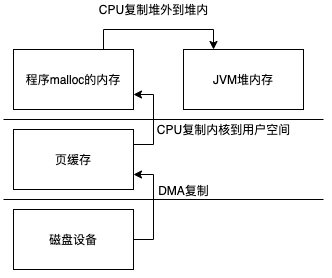
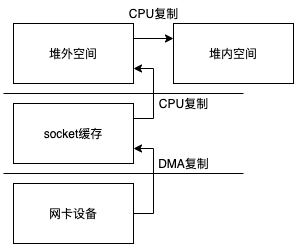

本文只考虑Linux系统

### 传统IO

+ ServerSocket
+ Socket

首先通常c语言中访问网络

```c
int main() {
  //创建socket描述符
    int socketfd = socket(AF_INET, SOCK_STREAM, IPPROTO_TCP);
    struct sockaddr_in servaddr;
    bzero(&servaddr, sizeof(servaddr));
    servaddr.sin_family = AF_INET;
    servaddr.sin_addr.s_addr = inet_addr("127.0.0.1");
    servaddr.sin_port = htons(8840);
  //绑定地址
    int r = bind(socketfd, &servaddr, sizeof(servaddr));
    if (r != 0) {
        printf("listen error");
        return 1;
    }
  //开启监听
    r = listen(socketfd, 10);
    if (r != 0) {
        printf("listen error");
        return 1;
    }
    struct sockaddr_in clientAddr;
    socklen_t clientAddrLen = sizeof(clientAddr);
    while (1){
      //接收连接请求，其实操作系统会把3次握手完成后才返回给我们
        int clientFd = accept(socketfd, &clientAddr, &clientAddrLen);
      //创建一个新的进程去处理连接
        pid_t pid = fork();
      //子进程进入这个循环体
        while (pid==0) {
            char data[10]={0,0,0,0,0,0,0,0,0,0};
            read(clientFd, data, 8);
            write(clientFd, data, 8);
            if (data[0]=='q'){
                printf("close(clientFd); \n");
                close(clientFd);
                exit(0);
            }
        }
      //父进程直接关闭这个链接，其实只是关闭了一个进程和描述符的联系，只要还有一个进程和该描述符有关联描述符就不会关闭
        close(clientFd);
    }
}
```

所以在使用c语言直接使用系统调用提供一个服务时需要如下几个步骤

+ socket 创建一个socket
+ bind 为一个socket绑定地址
+ listen 开始监听 服务这时已经启动
+ accept 获取客户端的链接 会返回一个新的描述符号，如果是阻塞模式下这里会阻塞到有新的请求
+ read&write 使用新的描述符进行操作（也可以使用recv&send）

现在我们回到Java代码中实现一个类似的功能我们主要在系统调用的层面去看这些类的实现原理，不会过多的去关系jdk的实现细节

```java
//创建一个ServerSocket对象不会做任何系统调用
ServerSocket serverSocket = new ServerSocket();
//这里回做很多事情socket  bind  listen  这行代码执行后服务就已经启动了
serverSocket.bind(new InetSocketAddress("127.0.0.1",36352));
//获取一个连接 accept系统调用
Socket socket = serverSocket.accept();
//使用新的链接进行读写操作
socket.getInputStream().read();
socket.getOutputStream().write();
```

先来看一下bind方法

```java
public void bind(SocketAddress endpoint, int backlog) throws IOException {
    if (isClosed())
        throw new SocketException("Socket is closed");
    if (!oldImpl && isBound())
        throw new SocketException("Already bound");
    if (endpoint == null)
        endpoint = new InetSocketAddress(0);
    if (!(endpoint instanceof InetSocketAddress))
        throw new IllegalArgumentException("Unsupported address type");
    InetSocketAddress epoint = (InetSocketAddress) endpoint;
    if (epoint.isUnresolved())
        throw new SocketException("Unresolved address");
    if (backlog < 1)
        backlog = 50;
    try {
        SecurityManager security = System.getSecurityManager();
        if (security != null)
            security.checkListen(epoint.getPort());
      //功能实现都在这里2行
      //第一次调用getImpl()回去调用socket系统调用创建socket
      //bind直接对应bind系统调用
        getImpl().bind(epoint.getAddress(), epoint.getPort());
      //listen直接对应listen系统调用
        getImpl().listen(backlog);
        bound = true;
    } catch(SecurityException e) {
        bound = false;
        throw e;
    } catch(IOException e) {
        bound = false;
        throw e;
    }
}
SocketImpl getImpl() throws SocketException {
    if (!created)
        createImpl();
    return impl;
}
void createImpl() throws SocketException {
    if (impl == null)
        setImpl();
    try {
        impl.create(true);
        created = true;
    } catch (IOException e) {
        throw new SocketException(e.getMessage());
    }
}

/**
* AbstractPlainSocketImpl
*/
protected synchronized void create(boolean stream) throws IOException {
    this.stream = stream;
    if (!stream) {
        ResourceManager.beforeUdpCreate();
        // only create the fd after we know we will be able to create the socket
        fd = new FileDescriptor();
        try {
  				//在PlainSocketImpl类中声明为native方法 
            socketCreate(false);
            SocketCleanable.register(fd, false);
        } catch (IOException ioe) {
            ResourceManager.afterUdpClose();
            fd = null;
            throw ioe;
        }
    } else {
        fd = new FileDescriptor();
  		//在PlainSocketImpl类中声明为native方法 
        socketCreate(true);
        SocketCleanable.register(fd, true);
    }
    if (socket != null)
        socket.setCreated();
    if (serverSocket != null)
        serverSocket.setCreated();
}
protected synchronized void bind(InetAddress address, int lport)
    throws IOException
{
    synchronized (fdLock) {
        if (!closePending && (socket == null || !socket.isBound())) {
            NetHooks.beforeTcpBind(fd, address, lport);
        }
    }
  //在PlainSocketImpl类中声明为native方法 
    socketBind(address, lport);
    if (socket != null)
        socket.setBound();
    if (serverSocket != null)
        serverSocket.setBound();
}

protected synchronized void listen(int count) throws IOException {
  //在PlainSocketImpl类中声明为native方法 
    socketListen(count);
}
```

可以看到在bind方法中就完成一个socket的create、bind、listen三个过程，接着单我们调用accept的时候

```java
public Socket accept() throws IOException {
    if (isClosed())
        throw new SocketException("Socket is closed");
    if (!isBound())
        throw new SocketException("Socket is not bound yet");
  //创建一个新的Socket对象用于处理客户端的请求
    Socket s = new Socket((SocketImpl) null);
    implAccept(s);
    return s;
}

protected final void implAccept(Socket s) throws IOException {
    SocketImpl si = null;
    try {
      //这里基本就是初始化一下Socket
        if (s.impl == null)
            s.setImpl();
        else {
            s.impl.reset();
        }
        si = s.impl;
        s.impl = null;
      //这里InetAddress和FileDescriptor会在c代码中设置进去
        si.address = new InetAddress();
        si.fd = new FileDescriptor();
      
      //看下面
        getImpl().accept(si);
        SocketCleanable.register(si.fd, true);   // raw fd has been set

        SecurityManager security = System.getSecurityManager();
        if (security != null) {
            security.checkAccept(si.getInetAddress().getHostAddress(),
                                    si.getPort());
        }
    } catch (IOException e) {
        if (si != null)
            si.reset();
        s.impl = si;
        throw e;
    } catch (SecurityException e) {
        if (si != null)
            si.reset();
        s.impl = si;
        throw e;
    }
    s.impl = si;
    s.postAccept();
}

/**
* AbstractPlainSocketImpl
*/
protected void accept(SocketImpl s) throws IOException {
  	acquireFD();
  	try {
		  //在PlainSocketImpl类中声明为native方法 
        socketAccept(s);
  	} finally {
        releaseFD();
  	}
}
```


看一下native的实现

```c
/*
* PlainSocketImpl 这个文件在不同操作系统下面有不同实现，我们看的是unix系统的实现
*/
JNIEXPORT void JNICALL
Java_java_net_PlainSocketImpl_socketCreate(JNIEnv *env, jobject this,
                                           jboolean stream) {
    jobject fdObj, ssObj;
    int fd;
  //tcp还是udp
    int type = (stream ? SOCK_STREAM : SOCK_DGRAM);
    int domain = ipv6_available() ? AF_INET6 : AF_INET;

    if (socketExceptionCls == NULL) {
        jclass c = (*env)->FindClass(env, "java/net/SocketException");
        CHECK_NULL(c);
        socketExceptionCls = (jclass)(*env)->NewGlobalRef(env, c);
        CHECK_NULL(socketExceptionCls);
    }
    fdObj = (*env)->GetObjectField(env, this, psi_fdID);

    if (fdObj == NULL) {
        (*env)->ThrowNew(env, socketExceptionCls, "null fd object");
        return;
    }
  //创建socket
    if ((fd = socket(domain, type, 0)) == -1) {
        /* note: if you run out of fds, you may not be able to load
         * the exception class, and get a NoClassDefFoundError
         * instead.
         */
        NET_ThrowNew(env, errno, "can't create socket");
        return;
    }

    /* Disable IPV6_V6ONLY to ensure dual-socket support */
    if (domain == AF_INET6) {
        int arg = 0;
        if (setsockopt(fd, IPPROTO_IPV6, IPV6_V6ONLY, (char*)&arg,
                       sizeof(int)) < 0) {
            NET_ThrowNew(env, errno, "cannot set IPPROTO_IPV6");
            close(fd);
            return;
        }
    }

    /*
     * If this is a server socket then enable SO_REUSEADDR
     * automatically and set to non blocking.
     */
    ssObj = (*env)->GetObjectField(env, this, psi_serverSocketID);
    if (ssObj != NULL) {
        int arg = 1;
      //设置为非阻塞
        SET_NONBLOCKING(fd);
        if (NET_SetSockOpt(fd, SOL_SOCKET, SO_REUSEADDR, (char*)&arg,
                       sizeof(arg)) < 0) {
            NET_ThrowNew(env, errno, "cannot set SO_REUSEADDR");
            close(fd);
            return;
        }
    }
  //设置描述符
    (*env)->SetIntField(env, fdObj, IO_fd_fdID, fd);
}


JNIEXPORT void JNICALL
Java_java_net_PlainSocketImpl_socketBind(JNIEnv *env, jobject this,
                                         jobject iaObj, jint localport) {

    /* fdObj is the FileDescriptor field on this */
    jobject fdObj = (*env)->GetObjectField(env, this, psi_fdID);
    /* fd is an int field on fdObj */
    int fd;
    int len = 0;
    SOCKETADDRESS sa;

    if (IS_NULL(fdObj)) {
        JNU_ThrowByName(env, JNU_JAVANETPKG "SocketException",
                        "Socket closed");
        return;
    } else {
      //拿到描述符
        fd = (*env)->GetIntField(env, fdObj, IO_fd_fdID);
    }
    if (IS_NULL(iaObj)) {
        JNU_ThrowNullPointerException(env, "iaObj is null.");
        return;
    }

    /* bind */
    if (NET_InetAddressToSockaddr(env, iaObj, localport, &sa,
                                  &len, JNI_TRUE) != 0) {
        return;
    }
    setDefaultScopeID(env, &sa.sa);

  //NET_Bind内部调用bind系统调用
    if (NET_Bind(fd, &sa, len) < 0) {
        if (errno == EADDRINUSE || errno == EADDRNOTAVAIL ||
            errno == EPERM || errno == EACCES) {
            NET_ThrowByNameWithLastError(env, JNU_JAVANETPKG "BindException",
                           "Bind failed");
        } else {
            JNU_ThrowByNameWithMessageAndLastError
                (env, JNU_JAVANETPKG "SocketException", "Bind failed");
        }
        return;
    }

    /* set the address */
    (*env)->SetObjectField(env, this, psi_addressID, iaObj);

    /* initialize the local port */
    if (localport == 0) {
        socklen_t slen = sizeof(SOCKETADDRESS);
        /* Now that we're a connected socket, let's extract the port number
         * that the system chose for us and store it in the Socket object.
         */
        if (getsockname(fd, &sa.sa, &slen) == -1) {
            JNU_ThrowByNameWithMessageAndLastError
                (env, JNU_JAVANETPKG "SocketException", "Error getting socket name");
            return;
        }
        localport = NET_GetPortFromSockaddr(&sa);
        (*env)->SetIntField(env, this, psi_localportID, localport);
    } else {
        (*env)->SetIntField(env, this, psi_localportID, localport);
    }
}

JNIEXPORT void JNICALL
Java_java_net_PlainSocketImpl_socketListen(JNIEnv *env, jobject this,
                                           jint count)
{
    /* this FileDescriptor fd field */
    jobject fdObj = (*env)->GetObjectField(env, this, psi_fdID);
    /* fdObj's int fd field */
    int fd;

    if (IS_NULL(fdObj)) {
        JNU_ThrowByName(env, JNU_JAVANETPKG "SocketException",
                        "Socket closed");
        return;
    } else {
        fd = (*env)->GetIntField(env, fdObj, IO_fd_fdID);
    }

    /*
     * Workaround for bugid 4101691 in Solaris 2.6. See 4106600.
     * If listen backlog is Integer.MAX_VALUE then subtract 1.
     */
    if (count == 0x7fffffff)
        count -= 1;

  //调用listen系统调用
    if (listen(fd, count) == -1) {
        JNU_ThrowByNameWithMessageAndLastError
            (env, JNU_JAVANETPKG "SocketException", "Listen failed");
    }
}

JNIEXPORT void JNICALL
Java_java_net_PlainSocketImpl_socketAccept(JNIEnv *env, jobject this,
                                           jobject socket)
{
    /* fields on this */
    int port;
    jint timeout = (*env)->GetIntField(env, this, psi_timeoutID);
    jlong prevNanoTime = 0;
    jlong nanoTimeout = (jlong) timeout * NET_NSEC_PER_MSEC;
    jobject fdObj = (*env)->GetObjectField(env, this, psi_fdID);

    /* the FileDescriptor field on socket */
    jobject socketFdObj;
    /* the InetAddress field on socket */
    jobject socketAddressObj;

    /* the ServerSocket fd int field on fdObj */
    jint fd;

    /* accepted fd */
  //接收到的描述符
    jint newfd;

    SOCKETADDRESS sa;
    socklen_t slen = sizeof(SOCKETADDRESS);

    if (IS_NULL(fdObj)) {
        JNU_ThrowByName(env, JNU_JAVANETPKG "SocketException",
                        "Socket closed");
        return;
    } else {
        fd = (*env)->GetIntField(env, fdObj, IO_fd_fdID);
    }
    if (IS_NULL(socket)) {
        JNU_ThrowNullPointerException(env, "socket is null");
        return;
    }

    /*
     * accept connection but ignore ECONNABORTED indicating that
     * connection was eagerly accepted by the OS but was reset
     * before accept() was called.
     *
     * If accept timeout in place and timeout is adjusted with
     * each ECONNABORTED or EWOULDBLOCK or EAGAIN to ensure that
     * semantics of timeout are preserved.
     */
  //这里for循环是因为实现超时，之前说过服务端socket是非阻塞的，然后这里通过循环调用accept，取得连接或者超时
  //setSoTimeout()设置超时时间
    for (;;) {
        int ret;
        jlong currNanoTime;

        /* first usage pick up current time */
        if (prevNanoTime == 0 && nanoTimeout > 0) {
            prevNanoTime = JVM_NanoTime(env, 0);
        }

        /* passing a timeout of 0 to poll will return immediately,
           but in the case of ServerSocket 0 means infinite. */
        if (timeout <= 0) {
            ret = NET_Timeout(env, fd, -1, 0);
        } else {
            ret = NET_Timeout(env, fd, nanoTimeout / NET_NSEC_PER_MSEC, prevNanoTime);
        }
        if (ret == 0) {
            JNU_ThrowByName(env, JNU_JAVANETPKG "SocketTimeoutException",
                            "Accept timed out");
            return;
        } else if (ret == -1) {
            if (errno == EBADF) {
               JNU_ThrowByName(env, JNU_JAVANETPKG "SocketException", "Socket closed");
            } else if (errno == ENOMEM) {
               JNU_ThrowOutOfMemoryError(env, "NET_Timeout native heap allocation failed");
            } else {
               JNU_ThrowByNameWithMessageAndLastError
                   (env, JNU_JAVANETPKG "SocketException", "Accept failed");
            }
            return;
        }
      //这里调用系统调用accept获取新的描述符
        newfd = NET_Accept(fd, &sa.sa, &slen);

        /* connection accepted */
        if (newfd >= 0) {
          //获取到描述符就先把它设置成阻塞的
            SET_BLOCKING(newfd);
            break;
        }

        /* non (ECONNABORTED or EWOULDBLOCK or EAGAIN) error */
        if (!(errno == ECONNABORTED || errno == EWOULDBLOCK || errno == EAGAIN)) {
            break;
        }

        /* ECONNABORTED or EWOULDBLOCK or EAGAIN error so adjust timeout if there is one. */
        if (nanoTimeout >= NET_NSEC_PER_MSEC) {
            currNanoTime = JVM_NanoTime(env, 0);
            nanoTimeout -= (currNanoTime - prevNanoTime);
            if (nanoTimeout < NET_NSEC_PER_MSEC) {
                JNU_ThrowByName(env, JNU_JAVANETPKG "SocketTimeoutException",
                        "Accept timed out");
                return;
            }
            prevNanoTime = currNanoTime;
        }
    }

    if (newfd < 0) {
        if (newfd == -2) {
            JNU_ThrowByName(env, JNU_JAVAIOPKG "InterruptedIOException",
                            "operation interrupted");
        } else {
            if (errno == EINVAL) {
                errno = EBADF;
            }
            if (errno == EBADF) {
                JNU_ThrowByName(env, JNU_JAVANETPKG "SocketException", "Socket closed");
            } else {
                JNU_ThrowByNameWithMessageAndLastError
                    (env, JNU_JAVANETPKG "SocketException", "Accept failed");
            }
        }
        return;
    }

    /*
     * fill up the remote peer port and address in the new socket structure.
     */
    socketAddressObj = NET_SockaddrToInetAddress(env, &sa, &port);
    if (socketAddressObj == NULL) {
        /* should be pending exception */
        close(newfd);
        return;
    }

    /*
     * Populate SocketImpl.fd.fd
     */
  //设置描述符和地址信息到accept方法中创建的Socket中
    socketFdObj = (*env)->GetObjectField(env, socket, psi_fdID);
    (*env)->SetIntField(env, socketFdObj, IO_fd_fdID, newfd);

    (*env)->SetObjectField(env, socket, psi_addressID, socketAddressObj);
    (*env)->SetIntField(env, socket, psi_portID, port);
    /* also fill up the local port information */
     port = (*env)->GetIntField(env, this, psi_localportID);
    (*env)->SetIntField(env, socket, psi_localportID, port);
}
```

read&write方法我们往下看客户端代码的时候一起讲解，因为他们属于Socket类

我们再来看一下客户端的代码

```c
int main()
{
  //创建socket
    int socketfd = socket(AF_INET,SOCK_STREAM,IPPROTO_TCP);
    struct sockaddr_in servaddr;
    bzero(&servaddr,sizeof(servaddr));
    servaddr.sin_family=AF_INET;//设置地址类型为AF_INET
    servaddr.sin_addr.s_addr=inet_addr("127.0.0.1");//设置网络地址为INADDR_ANY
    servaddr.sin_port=htons(8840);//设置端口为80
  
  //创建连接到服务端
    connect(socketfd,&servaddr,sizeof(servaddr));

    while (1){
        char data[10];
        printf("\n输入要发送的数据：");
        scanf("%s",data);
      //发送数据到服务端
        write(socketfd,data,8);
      //从服务端接收数据
        read(socketfd,data,8);
        printf("服务器回应 %s \n", data);
    }
  //关闭socket
    close(socketfd);
    return 0;
}
```

整个过程大致就是

+ socket函数创建socket
+ connect函数建立连接（3次握手就是这里完成的）
+ read&write 进行操作（也可以使用recv&send）

在java中的代码

```java
//这里创建一个java对象 没有创建socket
Socket socket = new Socket();
//这里如果没有创建socket的话会创建，然后调用connect函数连接
socket.connect(new InetSocketAddress("127.0.0.1",36352));
socket.getOutputStream().write(bytes);
socket.getInputStream().read(bytes);
```

先来看一下connect的实现

```java
public void connect(SocketAddress endpoint, int timeout) throws IOException {
    if (endpoint == null)
        throw new IllegalArgumentException("connect: The address can't be null");

    if (timeout < 0)
      throw new IllegalArgumentException("connect: timeout can't be negative");

    if (isClosed())
        throw new SocketException("Socket is closed");

    if (!oldImpl && isConnected())
        throw new SocketException("already connected");

    if (!(endpoint instanceof InetSocketAddress))
        throw new IllegalArgumentException("Unsupported address type");

    InetSocketAddress epoint = (InetSocketAddress) endpoint;
    InetAddress addr = epoint.getAddress ();
    int port = epoint.getPort();
    checkAddress(addr, "connect");

    SecurityManager security = System.getSecurityManager();
    if (security != null) {
        if (epoint.isUnresolved())
            security.checkConnect(epoint.getHostName(), port);
        else
            security.checkConnect(addr.getHostAddress(), port);
    }
    if (!created)
      //这里创建socket，创建后会把系统的描述符写到Java对象中
        createImpl(true);
    if (!oldImpl)
      //这里建立连接
        impl.connect(epoint, timeout);
    else if (timeout == 0) {
        if (epoint.isUnresolved())
            impl.connect(addr.getHostName(), port);
        else
            impl.connect(addr, port);
    } else
        throw new UnsupportedOperationException("SocketImpl.connect(addr, timeout)");
    connected = true;
    /*
     * If the socket was not bound before the connect, it is now because
     * the kernel will have picked an ephemeral port & a local address
     */
    bound = true;
}
```

createImpl调用了AbstractPlainSocketImpl里面的create，这个可以参考之前服务端的代码是一样的

impl.connect的情况比较复杂这里节省篇幅不展开说明了，最终它都会调用到AbstractPlainSocketImpl的doConnect方法然后调用native方法socketConnect，我们来看一下socketConnect的c代码实现

```c
JNIEXPORT void JNICALL
Java_java_net_PlainSocketImpl_socketConnect(JNIEnv *env, jobject this,
                                            jobject iaObj, jint port,
                                            jint timeout)
{
    jint localport = (*env)->GetIntField(env, this, psi_localportID);
    int len = 0;
    /* fdObj is the FileDescriptor field on this */
    jobject fdObj = (*env)->GetObjectField(env, this, psi_fdID);
    jclass clazz = (*env)->GetObjectClass(env, this);
    jobject fdLock;
    jint trafficClass = (*env)->GetIntField(env, this, psi_trafficClassID);
    /* fd is an int field on iaObj */
    jint fd;
    SOCKETADDRESS sa;
    /* The result of the connection */
    int connect_rv = -1;

    if (IS_NULL(fdObj)) {
        JNU_ThrowByName(env, JNU_JAVANETPKG "SocketException", "Socket closed");
        return;
    } else {
        fd = (*env)->GetIntField(env, fdObj, IO_fd_fdID);
    }
    if (IS_NULL(iaObj)) {
        JNU_ThrowNullPointerException(env, "inet address argument null.");
        return;
    }
    if (NET_InetAddressToSockaddr(env, iaObj, port, &sa, &len,
                                  JNI_TRUE) != 0) {
        return;
    }
    setDefaultScopeID(env, &sa.sa);
    if (trafficClass != 0 && ipv6_available()) {
        NET_SetTrafficClass(&sa, trafficClass);
    }
    if (timeout <= 0) {
      //这里进行连接，NET_Connect这个宏定义内部进行了重试操作
      //因为timeout无限所以这里是阻塞的循环进行重试
        connect_rv = NET_Connect(fd, &sa.sa, len);
#ifdef __solaris__
      ...
#endif
    } else {
      //设置成非阻塞
        SET_NONBLOCKING(fd);
      //连接，这样可以自己实现超时
        connect_rv = connect(fd, &sa.sa, len);
        if (connect_rv != 0) {
            socklen_t optlen;
            jlong nanoTimeout = (jlong) timeout * NET_NSEC_PER_MSEC;
            jlong prevNanoTime = JVM_NanoTime(env, 0);

            if (errno != EINPROGRESS) {
                NET_ThrowByNameWithLastError(env, JNU_JAVANETPKG "ConnectException",
                             "connect failed");
                SET_BLOCKING(fd);
                return;
            }
            while (1) {
                jlong newNanoTime;
                struct pollfd pfd;
                pfd.fd = fd;
                pfd.events = POLLOUT;

                errno = 0;
                connect_rv = NET_Poll(&pfd, 1, nanoTimeout / NET_NSEC_PER_MSEC);

                if (connect_rv >= 0) {
                    break;
                }
                if (errno != EINTR) {
                    break;
                }
                newNanoTime = JVM_NanoTime(env, 0);
                nanoTimeout -= (newNanoTime - prevNanoTime);
                if (nanoTimeout < NET_NSEC_PER_MSEC) {
                    connect_rv = 0;
                    break;
                }
                prevNanoTime = newNanoTime;

            } /* while */
            if (connect_rv == 0) {
                JNU_ThrowByName(env, JNU_JAVANETPKG "SocketTimeoutException",
                            "connect timed out");
                SET_BLOCKING(fd);
                shutdown(fd, 2);
                return;
            }
            optlen = sizeof(connect_rv);
            if (getsockopt(fd, SOL_SOCKET, SO_ERROR, (void*)&connect_rv,
                           &optlen) <0) {
                connect_rv = errno;
            }
        }
        SET_BLOCKING(fd);
        if (connect_rv != 0) {
            errno = connect_rv;
            connect_rv = -1;
        }
    }
    if (connect_rv < 0) {

#ifdef __linux__
        if (connect_rv == -1 && errno == EINVAL) {
            JNU_ThrowByName(env, JNU_JAVANETPKG "SocketException",
                "Invalid argument or cannot assign requested address");
            return;
        }
#endif
#if defined(EPROTO)
        if (errno == EPROTO) {
            NET_ThrowByNameWithLastError(env, JNU_JAVANETPKG "ProtocolException",
                           "Protocol error");
            return;
        }
#endif
        if (errno == ECONNREFUSED) {
            NET_ThrowByNameWithLastError(env, JNU_JAVANETPKG "ConnectException",
                           "Connection refused");
        } else if (errno == ETIMEDOUT) {
            NET_ThrowByNameWithLastError(env, JNU_JAVANETPKG "ConnectException",
                           "Connection timed out");
        } else if (errno == EHOSTUNREACH) {
            NET_ThrowByNameWithLastError(env, JNU_JAVANETPKG "NoRouteToHostException",
                           "Host unreachable");
        } else if (errno == EADDRNOTAVAIL) {
            NET_ThrowByNameWithLastError(env, JNU_JAVANETPKG "NoRouteToHostException",
                             "Address not available");
        } else if ((errno == EISCONN) || (errno == EBADF)) {
            JNU_ThrowByName(env, JNU_JAVANETPKG "SocketException",
                            "Socket closed");
        } else {
            JNU_ThrowByNameWithMessageAndLastError
                (env, JNU_JAVANETPKG "SocketException", "connect failed");
        }
        return;
    }
    (*env)->SetIntField(env, fdObj, IO_fd_fdID, fd);
    (*env)->SetObjectField(env, this, psi_addressID, iaObj);
    (*env)->SetIntField(env, this, psi_portID, port);
    if (localport == 0) {
        socklen_t slen = sizeof(SOCKETADDRESS);
        if (getsockname(fd, &sa.sa, &slen) == -1) {
            JNU_ThrowByNameWithMessageAndLastError
                (env, JNU_JAVANETPKG "SocketException", "Error getting socket name");
        } else {
            localport = NET_GetPortFromSockaddr(&sa);
            (*env)->SetIntField(env, this, psi_localportID, localport);
        }
    }
}
```

最后我们来看一下read&write方法

首先socket.getOutputStream()最终调用AbstractPlainSocketImpl的getOutputStream方法

```java
protected synchronized OutputStream getOutputStream() throws IOException {
    synchronized (fdLock) {
        if (isClosedOrPending())
            throw new IOException("Socket Closed");
        if (shut_wr)
            throw new IOException("Socket output is shutdown");
        if (socketOutputStream == null)
          //这里返回了一个SocketOutputStream
            socketOutputStream = new SocketOutputStream(this);
    }
    return socketOutputStream;
}
```

socket.getInputStream()最终调用AbstractPlainSocketImpl的getInputStream方法

```java
protected synchronized InputStream getInputStream() throws IOException {
    synchronized (fdLock) {
        if (isClosedOrPending())
            throw new IOException("Socket Closed");
        if (shut_rd)
            throw new IOException("Socket input is shutdown");
        if (socketInputStream == null)
          //这里返回了一个SocketInputStream
            socketInputStream = new SocketInputStream(this);
    }
    return socketInputStream;
}
```

SocketInputStream与SocketOutputStream继承了FileInputStream与FileOutputStream但是他们重写了read和wirte方法

```java
SocketInputStream(AbstractPlainSocketImpl impl) throws IOException {
  //这个不知道的可以回去看文件IO那篇文章 https://www.zhoukaifan.com/2021-02-05/Java%E6%96%87%E4%BB%B6IO
    super(impl.getFileDescriptor());
    this.impl = impl;
    socket = impl.getSocket();
}
SocketOutputStream(AbstractPlainSocketImpl impl) throws IOException {
  //这个不知道的可以回去看文件IO那篇文章 https://www.zhoukaifan.com/2021-02-05/Java%E6%96%87%E4%BB%B6IO
    super(impl.getFileDescriptor());
    this.impl = impl;
    socket = impl.getSocket();
}
```

接下来我们已SocketInputStream为例去分析一下具体实现

```java
int read(byte b[], int off, int length, int timeout) throws IOException {
    int n;
    // EOF already encountered
    if (eof) {
        return -1;
    }
    // connection reset
    if (impl.isConnectionReset()) {
        throw new SocketException("Connection reset");
    }
    // bounds check
    if (length <= 0 || off < 0 || length > b.length - off) {
        if (length == 0) {
            return 0;
        }
        throw new ArrayIndexOutOfBoundsException("length == " + length
                + " off == " + off + " buffer length == " + b.length);
    }
    // acquire file descriptor and do the read
  //获取描述符
    FileDescriptor fd = impl.acquireFD();
    try {
      //主要就是这里实现的读取
      //这个方法就一行代码就是调用native方法socketRead0
      //return socketRead0(fd, b, off, len, timeout);
        n = socketRead(fd, b, off, length, timeout);
        if (n > 0) {
            return n;
        }
    } catch (ConnectionResetException rstExc) {
        impl.setConnectionReset();
    } finally {
        impl.releaseFD();
    }

    /*
     * If we get here we are at EOF, the socket has been closed,
     * or the connection has been reset.
     */
    if (impl.isClosedOrPending()) {
        throw new SocketException("Socket closed");
    }
    if (impl.isConnectionReset()) {
        throw new SocketException("Connection reset");
    }
    eof = true;
    return -1;
}
```

接着我们看看socketRead0的实现

```c
JNIEXPORT jint JNICALL
Java_java_net_SocketInputStream_socketRead0(JNIEnv *env, jobject this,
                                            jobject fdObj, jbyteArray data,
                                            jint off, jint len, jint timeout)
{
    char BUF[MAX_BUFFER_LEN];
    char *bufP;
    jint fd, nread;

    if (IS_NULL(fdObj)) {
        JNU_ThrowByName(env, "java/net/SocketException",
                        "Socket closed");
        return -1;
    }
  //获取描述符
    fd = (*env)->GetIntField(env, fdObj, IO_fd_fdID);
    if (fd == -1) {
        JNU_ThrowByName(env, "java/net/SocketException", "Socket closed");
        return -1;
    }

    /*
     * If the read is greater than our stack allocated buffer then
     * we allocate from the heap (up to a limit)
     */
    if (len > MAX_BUFFER_LEN) {
        if (len > MAX_HEAP_BUFFER_LEN) {
            len = MAX_HEAP_BUFFER_LEN;
        }
      //申请堆外内存
        bufP = (char *)malloc((size_t)len);
        if (bufP == NULL) {
            bufP = BUF;
            len = MAX_BUFFER_LEN;
        }
    } else {
        bufP = BUF;
    }
    if (timeout) {
      //读取数据到堆外 有超时实现
      //这里老样子用非阻塞实现超时
      //不过要注意的是不是socket设置成非阻塞而是使用了recv函数 参考这里 https://linux.die.net/man/2/recv
        nread = NET_ReadWithTimeout(env, fd, bufP, len, timeout);
        if ((*env)->ExceptionCheck(env)) {
            if (bufP != BUF) {
                free(bufP);
            }
            return nread;
        }
    } else {
      //读取数据到堆外
        nread = NET_Read(fd, bufP, len);
    }

    if (nread <= 0) {
        if (nread < 0) {

            switch (errno) {
                case ECONNRESET:
                case EPIPE:
                    JNU_ThrowByName(env, "sun/net/ConnectionResetException",
                        "Connection reset");
                    break;

                case EBADF:
                    JNU_ThrowByName(env, "java/net/SocketException",
                        "Socket closed");
                    break;

                case EINTR:
                     JNU_ThrowByName(env, "java/io/InterruptedIOException",
                           "Operation interrupted");
                     break;
                default:
                    JNU_ThrowByNameWithMessageAndLastError
                        (env, "java/net/SocketException", "Read failed");
            }
        }
    } else {
      //设置数据到堆内
        (*env)->SetByteArrayRegion(env, data, off, nread, (jbyte *)bufP);
    }
    if (bufP != BUF) {
      //释放堆外内存
        free(bufP);
    }
    return nread;
}
```

所以传统Socket类的过程基本和传统文件IO类似。参考：[文件IO](https://www.zhoukaifan.com/2021-02-05/Java%E6%96%87%E4%BB%B6IO)



write方法的整个过程是类似的

### NIO中的Socket

服务端

```java
public static void main(String[] args) throws Exception {
    ServerSocketChannel serverSocketChannel = ServerSocketChannel.open();
    serverSocketChannel.bind(new InetSocketAddress("127.0.0.1",54321));
    SocketChannel accept = serverSocketChannel.accept();
    ByteBuffer byteBuffer = ByteBuffer.allocate(16);
    while (true){
        byteBuffer.clear();
        accept.read(byteBuffer);
        byteBuffer.flip();
        System.out.println("收到客户端消息："+new String(byteBuffer.array()));
        accept.write(byteBuffer);
    }
}
```

客户端

```java
public static void main(String[] args) throws Exception {
    SocketChannel socketChannel = SocketChannel.open();
    socketChannel.connect(new InetSocketAddress("127.0.0.1",54321));
    Scanner scanner = new Scanner(System.in);
    ByteBuffer byteBuffer = ByteBuffer.allocate(1111);
    while (true){
        System.out.print("请输入消息：");
        String str=scanner.next();
        byteBuffer.clear();
        byteBuffer.put(str.getBytes(StandardCharsets.UTF_8));
        byteBuffer.flip();
        socketChannel.write(byteBuffer);
        socketChannel.read(byteBuffer);
        System.out.println("服务器回应："+new String(byteBuffer.array()));
    }
}
```

我们先来看一下ServerSocketChannel的方法实现

```java
public static ServerSocketChannel open() throws IOException {
    return SelectorProvider.provider().openServerSocketChannel();
}
public ServerSocketChannel openServerSocketChannel() throws IOException {
	return new ServerSocketChannelImpl(this);
}
ServerSocketChannelImpl(SelectorProvider sp) throws IOException {
	super(sp);
	this.fd =  Net.serverSocket(true);
	//fdVal是一个native方法 其实就是拿到描述符
	this.fdVal = IOUtil.fdVal(fd);
}
//socket0是一个native方法  newFD会吧描述符号包装成一个
static FileDescriptor serverSocket(boolean stream) {
	return IOUtil.newFD(socket0(isIPv6Available(), stream, true, fastLoopback));
}
```

```c
JNIEXPORT jint JNICALL
Java_sun_nio_ch_IOUtil_fdVal(JNIEnv *env, jclass clazz, jobject fdo)
{
  //https://docs.oracle.com/en/java/javase/15/docs/specs/jni/functions.html#getfieldid
    return (*env)->GetIntField(env, fdo, fd_fdID);
}
```

```c
JNIEXPORT jint JNICALL
Java_sun_nio_ch_Net_socket0(JNIEnv *env, jclass cl, jboolean preferIPv6,
                            jboolean stream, jboolean reuse, jboolean ignored)
{
    int fd;
    int type = (stream ? SOCK_STREAM : SOCK_DGRAM);
    int domain = (ipv6_available() && preferIPv6) ? AF_INET6 : AF_INET;

  //创建描述符
    fd = socket(domain, type, 0);
    if (fd < 0) {
        return handleSocketError(env, errno);
    }

    /* Disable IPV6_V6ONLY to ensure dual-socket support */
    if (domain == AF_INET6) {
        int arg = 0;
      //设置IPV6_V6ONLY 不同时监听ipv4端口
        if (setsockopt(fd, IPPROTO_IPV6, IPV6_V6ONLY, (char*)&arg,
                       sizeof(int)) < 0) {
            JNU_ThrowByNameWithLastError(env,
                                         JNU_JAVANETPKG "SocketException",
                                         "Unable to set IPV6_V6ONLY");
            close(fd);
            return -1;
        }
    }

    if (reuse) {
        int arg = 1;
      //重用端口不再等待2分钟
        if (setsockopt(fd, SOL_SOCKET, SO_REUSEADDR, (char*)&arg,
                       sizeof(arg)) < 0) {
            JNU_ThrowByNameWithLastError(env,
                                         JNU_JAVANETPKG "SocketException",
                                         "Unable to set SO_REUSEADDR");
            close(fd);
            return -1;
        }
    }

#if defined(__linux__)
    if (type == SOCK_DGRAM) {
        int arg = 0;
        int level = (domain == AF_INET6) ? IPPROTO_IPV6 : IPPROTO_IP;
      //多播配置
        if ((setsockopt(fd, level, IP_MULTICAST_ALL, (char*)&arg, sizeof(arg)) < 0) &&
            (errno != ENOPROTOOPT)) {
            JNU_ThrowByNameWithLastError(env,
                                         JNU_JAVANETPKG "SocketException",
                                         "Unable to set IP_MULTICAST_ALL");
            close(fd);
            return -1;
        }
    }

    /* By default, Linux uses the route default */
    if (domain == AF_INET6 && type == SOCK_DGRAM) {
        int arg = 1;
      //设置多播跳数
        if (setsockopt(fd, IPPROTO_IPV6, IPV6_MULTICAST_HOPS, &arg,
                       sizeof(arg)) < 0) {
            JNU_ThrowByNameWithLastError(env,
                                         JNU_JAVANETPKG "SocketException",
                                         "Unable to set IPV6_MULTICAST_HOPS");
            close(fd);
            return -1;
        }
    }
#endif
    return fd;
}
```

所以在open方法调用的时候socket已经创建，和老的API不一样这里不会在用到的时候才去创建socket

再看一下bind

```java
public ServerSocketChannel bind(SocketAddress local, int backlog) throws IOException {
    synchronized (stateLock) {
        ensureOpen();
        if (localAddress != null)
            throw new AlreadyBoundException();
        InetSocketAddress isa = (local == null)
                                ? new InetSocketAddress(0)
                                : Net.checkAddress(local);
        SecurityManager sm = System.getSecurityManager();
        if (sm != null)
            sm.checkListen(isa.getPort());
        NetHooks.beforeTcpBind(fd, isa.getAddress(), isa.getPort());
      //bind看下面
        Net.bind(fd, isa.getAddress(), isa.getPort());
      //listen是一个native方法
        Net.listen(fd, backlog < 1 ? 50 : backlog);
        localAddress = Net.localAddress(fd);
    }
    return this;
}

public static void bind(FileDescriptor fd, InetAddress addr, int port)
    throws IOException
{
    bind(UNSPEC, fd, addr, port);
}

static void bind(ProtocolFamily family, FileDescriptor fd,
                    InetAddress addr, int port) throws IOException
{
    boolean preferIPv6 = isIPv6Available() &&
        (family != StandardProtocolFamily.INET);
  //这里调用native方法
    bind0(fd, preferIPv6, exclusiveBind, addr, port);
}
```

这里没什么好说的，就是做一些转换调用系统函数

```c
JNIEXPORT void JNICALL
Java_sun_nio_ch_Net_bind0(JNIEnv *env, jclass clazz, jobject fdo, jboolean preferIPv6,
                          jboolean useExclBind, jobject iao, int port)
{
    SOCKETADDRESS sa;
    int sa_len = 0;
    int rv = 0;

    if (NET_InetAddressToSockaddr(env, iao, port, &sa, &sa_len,
                                  preferIPv6) != 0) {
        return;
    }

    rv = NET_Bind(fdval(env, fdo), &sa, sa_len);
    if (rv != 0) {
        handleSocketError(env, errno);
    }
}
JNIEXPORT void JNICALL
Java_sun_nio_ch_Net_listen(JNIEnv *env, jclass cl, jobject fdo, jint backlog)
{
    if (listen(fdval(env, fdo), backlog) < 0)
        handleSocketError(env, errno);
}
```

最后来看一下accrpt方法的实现

```java
public SocketChannel accept() throws IOException {
    acceptLock.lock();
    try {
        int n = 0;
        FileDescriptor newfd = new FileDescriptor();
        InetSocketAddress[] isaa = new InetSocketAddress[1];

        boolean blocking = isBlocking();
        try {
            begin(blocking);
            do {
              //这里实现功能
                n = accept(this.fd, newfd, isaa);
            } while (n == IOStatus.INTERRUPTED && isOpen());
        } finally {
            end(blocking, n > 0);
            assert IOStatus.check(n);
        }

        if (n < 1)
            return null;

        // newly accepted socket is initially in blocking mode
      //新建的默认是阻塞的
        IOUtil.configureBlocking(newfd, true);

        InetSocketAddress isa = isaa[0];
      //使用新的描述符创建SocketChannelImpl
        SocketChannel sc = new SocketChannelImpl(provider(), newfd, isa);

        // check permitted to accept connections from the remote address
        SecurityManager sm = System.getSecurityManager();
        if (sm != null) {
            try {
                sm.checkAccept(isa.getAddress().getHostAddress(), isa.getPort());
            } catch (SecurityException x) {
                sc.close();
                throw x;
            }
        }
        return sc;

    } finally {
        acceptLock.unlock();
    }
}

private int accept(FileDescriptor ssfd,
				FileDescriptor newfd,
				InetSocketAddress[] isaa) throws IOException
{
  //native方法
	return accept0(ssfd, newfd, isaa);
}
```

```c
JNIEXPORT jint JNICALL
Java_sun_nio_ch_ServerSocketChannelImpl_accept0(JNIEnv *env, jobject this,
                                                jobject ssfdo, jobject newfdo,
                                                jobjectArray isaa)
{
  //获取一堆需要的参数
    jint ssfd = (*env)->GetIntField(env, ssfdo, fd_fdID);
    jint newfd;
    SOCKETADDRESS sa;
    socklen_t sa_len = sizeof(SOCKETADDRESS);
    jobject remote_ia = 0;
    jobject isa;
    jint remote_port = 0;

    /*
     * accept connection but ignore ECONNABORTED indicating that
     * a connection was eagerly accepted but was reset before
     * accept() was called.
     */
    for (;;) {
      //系统调用
        newfd = accept(ssfd, &sa.sa, &sa_len);
        if (newfd >= 0) {
            break;
        }
        if (errno != ECONNABORTED) {
            break;
        }
        /* ECONNABORTED => restart accept */
    }

    if (newfd < 0) {
        if (errno == EAGAIN || errno == EWOULDBLOCK)
            return IOS_UNAVAILABLE;
        if (errno == EINTR)
            return IOS_INTERRUPTED;
        JNU_ThrowIOExceptionWithLastError(env, "Accept failed");
        return IOS_THROWN;
    }

  //设置描述符
    (*env)->SetIntField(env, newfdo, fd_fdID, newfd);
    remote_ia = NET_SockaddrToInetAddress(env, &sa, (int *)&remote_port);
    CHECK_NULL_RETURN(remote_ia, IOS_THROWN);
  //创建InetSocketAddress对象
    isa = (*env)->NewObject(env, isa_class, isa_ctorID, remote_ia, remote_port);
    CHECK_NULL_RETURN(isa, IOS_THROWN);
  //设置地址
    (*env)->SetObjectArrayElement(env, isaa, 0, isa);
    return 1;
}
```

后面就可以使用SocketChannel进行读写了

SocketChannel还可以使用open方法来创建 通常在客户端会这么使用，和ServerSocketChannel类似它最终创建SocketChannelImpl这里过程和ServerSocketChannel一模一样

```java
SocketChannelImpl(SelectorProvider sp) throws IOException {
    super(sp);
    this.fd = Net.socket(true);
    this.fdVal = IOUtil.fdVal(fd);
}
```

接着connect可以连接到服务器端，这里不过多介绍了，基本可以参考之前的进行理解

而read&write方法调用了IOUtil，这个和FileChannelImpl一样大家可以参考之前的文章[Java文件IO](https://www.zhoukaifan.com/2021-02-05/Java%E6%96%87%E4%BB%B6IO)

```java
public int read(ByteBuffer buf) throws IOException {
    Objects.requireNonNull(buf);

    readLock.lock();
    try {
        boolean blocking = isBlocking();
        int n = 0;
        try {
            beginRead(blocking);

            // check if input is shutdown
            if (isInputClosed)
                return IOStatus.EOF;

            if (blocking) {
                do {
                  //后面的代码在之前的文章中讲过
                    n = IOUtil.read(fd, buf, -1, nd);
                } while (n == IOStatus.INTERRUPTED && isOpen());
            } else {
                n = IOUtil.read(fd, buf, -1, nd);
            }
        } finally {
            endRead(blocking, n > 0);
            if (n <= 0 && isInputClosed)
                return IOStatus.EOF;
        }
        return IOStatus.normalize(n);
    } finally {
        readLock.unlock();
    }
}
```