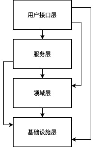
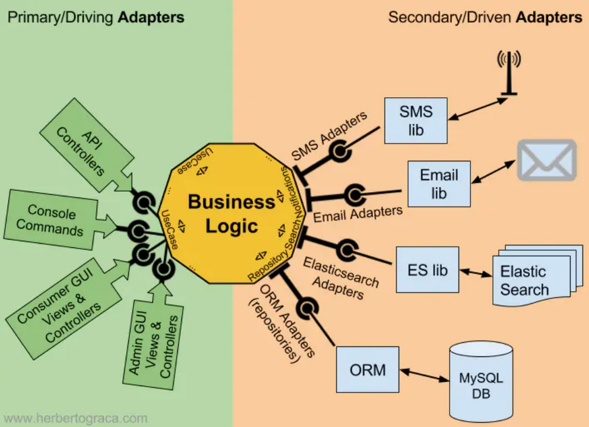
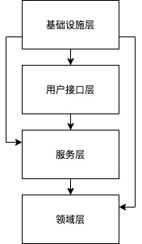
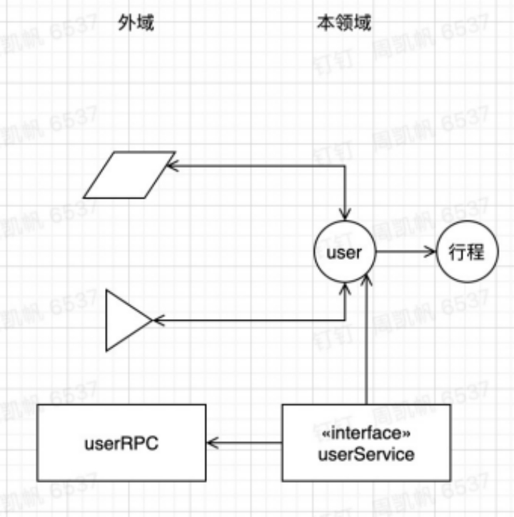
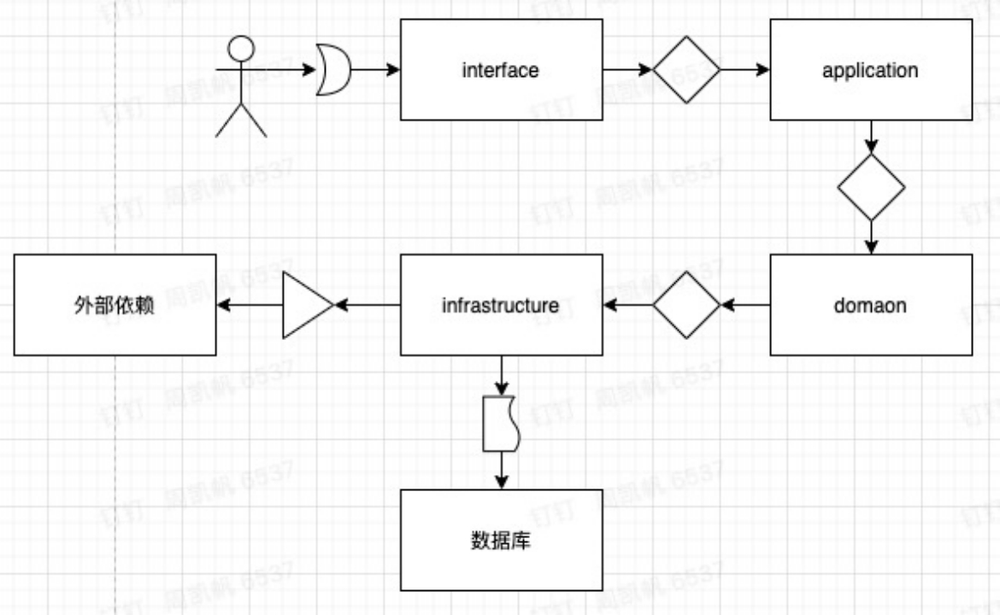
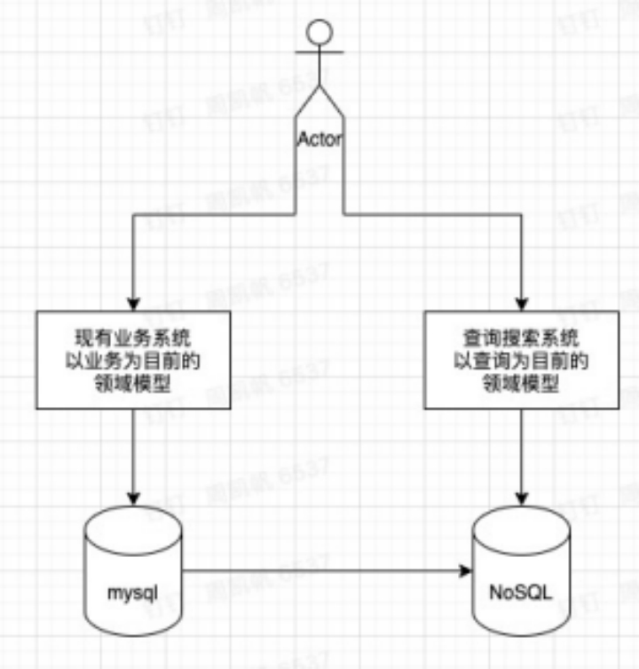

### 业务至上

+ 业务系统的根本是业务。软件的核心是解决领域内相关问题的能力，实现方式只是一种工具。DDD是为了应对复杂领域而存在的。

+ 技术解决不了业务问题，技术只能解决复杂业务附加的技术性问题，不要试图用技术去解决领域问题。
+ 面向对象将程序设计人员从应对复杂的数据存储计算中解放出来，从而可以专注于业务模型设计。用面向对象的思维方式去抽象领域并且建立模型是DDD的本质。

### 四层架构

+ 合理的分层可以让开发人员更加专注于领域本身
+ interface剥离走上游用户的交互，避免用户交互体验影响到领域模型
+ application存放业务流程，负责编排领域模型，负责发问下层回答，将domain层的业务组合成业务，避免domain层过多关注业务逻辑的执行过程
+ domain层是一切的核心，领域的模型被放于此处，domain层关注一个领域如何设计，关注领域的行为和能力，关注领域的关联，但是不关注具体业务流程，它可以定义行为，可以实现也可以不实现
+ infrastructure层是偏向技术的基础设施层，它承包一切技术性实现，它可以实现domain层的定义，如domain层定义了领域的资源库，infrastructure层可以提供一个mysql实现和一个redis实现。

第一层避免与领域无关的为了交互做妥协的出入参等代码污染领域代码

最后一层避免业务代码与某个具体技术强耦合，让领域层代码更专注领域问题

业务流程与领域模型的拆分，领域不等同于业务，application层把领域编排成业务，但是其本身无业务逻辑，这样可以避免领域模型的设计被强耦合到具体的业务上丧失了可扩展性。领域层应该是存粹的模型和其行为能力的定义与实现。

### 贫血VS充血

#### 贫血

+ 更适用于简单的业务逻辑
+ 更注重数据操作即CRUD操作
+ 更加面向过程思维但是成本更低
+ 适用简单业务快速迭代
+ 容易迭代成传统3层架构

#### 充血

+ 更面向对象
+ 注重领域能力定义
+ 提高代码复用
+ 避免service之间的大量相互调用

个人建议使用DDD必然充血，平血建议回到传统3层架构

### 端口适配器架构

> 让用户、程序、自动化测试和批处理脚本可以平等地驱动应用，让应用的开发和测试可以独立于其最终运行的设备和数据库。——Alistair Cockburn 2005

*注：图片来源于网络

大家可以阅读这篇文章了解端口适配器[https://herbertograca.com/2017/09/14/ports-adapters-architecture/](https://herbertograca.com/2017/09/14/ports-adapters-architecture/)

端口适配器的本质就是依赖接口不依赖实现

所以我们可以把四层架构演变成以下架构——依赖倒置

### 中台与DDD

业务中台的核心思想在于抽象沉淀不同业务中的共同点，以此降低新业务的开发成本。使用DDD指导中台建设是一个非常有效的方式。

DDD的核心在于关注领域模型和领域能力的建设，然后将其组合编排成业务，所以DDD的domain层的建设相对的中台有着天然的重合。

另外对于中台建设中通常无法避免链路编排与扩展点，而对于DDD中application层的定位我们可以结合链路编排来建设application层的能力，而扩展点则可以用于扩展domain层的领域能力，或者用于抉择application层的流程。

在中台服务的拆分中每个中台服务均会对外提供一个能力范围，每个中台应用会应对多种复杂业务场景设计出一个通用抽象的领域模型，但是实际上在某一业务中对于中台应用提供的能力会有自己的视角，这种情况下可以使用上下文映射的方式，在自己的系统中设计一个中台某个领域在本系统中的领域模型的映射，异常更好的关注自己所关心的部分。这种方式在交易这种串接上下的系统中特别有效。

### 反腐层

上下文映射的实现通常无法避免领域模型的转换，引入反腐层是一个非常优秀的设计，我们可以在基础设施层屏蔽掉模型的差异，让领域层更加专注领域本身。用户接口层也可以引入反腐层进行向上反腐。

### CQRS架构

*注：图片来源于网络

我不行过多的解释CQRS，大家可以自行查阅相关资料，我只对于其中提出的模型分离感兴趣，我更倾向于在足够复杂的场景下把用于处理业务的模型与用于查询的模型分离，以得到一个更加存粹用于处理业务的领域模型，这并不意味着读写分离，业务模型仍然会用于查询，但是仅限于主键查询并返回只关心本领域的业务模型数据。

### 业务模型与查询模型分离

在CQRS带来的思考后，我结合数据搜索中心的需求，将领域中的一切复杂查询剥离到搜索服务中

图中左边部分是原有的业务系统去除掉复杂查询（如列表查询，各种字段搜索排序，范围筛选）后的剩余部分。右边是一个专门用于搜索的领域模型，你甚至可以设计多种模型应对各种复杂的查询。

但是这并不是像CQRS那样使用command来处理业务，原有的业务系统的处理方式不会被改变。

### 存粹基于主键的业务设想

实际上在面向对象思想中业务的执行都在一个或者多个对象中进行，所以对于一切业务均可以使用业务主键进行操作。以此避免业务数据库的复杂索引的建立，我们只用解决如何找到这部分对象即可，通过搜索服务是一个方式（你的搜索服务必须足够可靠）如：用户页面查询到订单列表后进入详情页，点击退款。这时订单id就是用户通过搜索服务查询得到的。另外一种异步业务的处理也可以参考我之前的文章[业务事件中心设计](https://www.zhoukaifan.com/2021-01-19/业务事件中心设计)。